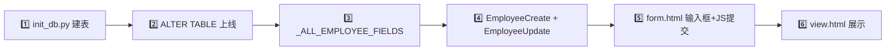

# Web CRUD 应用搭建

## 概述

使用 **FastAPI + aiosqlite + Jinja2** 搭建一个局域网可访问的 Web 业务管理系统。适用场景：员工档案、物资管理、数据采集、审批流程等内部工具。

## 触发条件

- 用户说"建一个 XX 管理系统"（人事、物资、档案等）
- 用户需要一个 **Web 表单 + 数据库** 的内部工具
- 用户需要评估：单机使用 → Web 方案；多人同时使用 → 必须 Web 方案

## 工作流程

### 1. 需求澄清（先做这一步，不要直接写代码）

按以下顺序澄清，每项用 clarify 工具确认：

| 轮次 | 问题 | 关键判断 |
|------|------|----------|
| 1 | **范围**：纯档案/采集？含考勤排班？含薪资绩效？先最小可用版本？ | 决定项目规模 |
| 2 | **前端形式**：Web 浏览器？桌面应用？ CLI/脚本？ | 多人用 = Web，单人本地可桌面 |
| 3 | **数据库**：SQLite（起步用）还是 MySQL/PostgreSQL？ | SQLite 够用就不上 PG |
| 4 | **使用场景**：单机本地？局域网多人？外网？ | 决定部署方式 |
| 5 | **字段设计**：给一个标准模板，让用户增减 | 确定表结构 |

**选型原则**：局域网多人 = Web 方案（FastAPI），不要尝试用 Tkinter/PyQt 解决多人问题。

### 2. 表结构设计

表名使用英文小写复数（`employees`、`products`），字段用 snake_case。

**典型字段类型模式**：

| 类型 | SQLite 类型 | 说明 |
|------|------------|------|
| 自增 ID | `INTEGER PRIMARY KEY AUTOINCREMENT` | 每个表必须有 |
| 唯一标识 | `TEXT UNIQUE NOT NULL` | 业务编号/工号/编码 |
| 文本字段 | `TEXT` / `TEXT NOT NULL` | 名称、描述等 |
| 日期 | `TEXT` | SQLite 无日期类型，存 'YYYY-MM-DD' |
| 时间戳 | `TEXT DEFAULT (datetime('now','localtime'))` | created_at / updated_at |
| 可选字段 | `TEXT` （不加 NOT NULL） | 用户可能不填的 |

### 3. 后端开发

```
项目结构：
project/
├── db/
│   ├── init_db.py     # 建表脚本
│   └── hrms.db        # SQLite 数据库文件
├── backend/
│   ├── main.py        # FastAPI 应用
│   └── templates/     # Jinja2 模板
├── venv/              # Python 虚拟环境
└── start.sh           # 启动脚本
```

#### 环境准备

```bash
python3 -m venv venv
venv/bin/pip install fastapi uvicorn aiosqlite jinja2 pydantic annotated-doc python-multipart
```

不要用 `uv init`，直接手动创建目录结构。

#### Pydantic 模型

创建两个模型类：
- `XxxCreate` — 新增时用，所有必填字段加上 `Field(..., min_length=1)` 校验
- `XxxUpdate` — 更新时用，**所有字段 Optional**，在 PUT 路由中 `exclude_none=True` 处理

#### 显式字段校验

对枚举类字段（性别、状态、类型等）使用 `@field_validator` 做服务端校验：

```python
@field_validator("gender")
@classmethod
def validate_gender(cls, v):
    if v not in ("男", "女"):
        raise ValueError("性别只能为 男 或 女")
    return v
```

### 4. ⚠️ Starlette 兼容性陷阱

**不要使用** `from fastapi.templating import Jinja2Templates`，在 Hermes 环境下会触发：

```
TypeError: unhashable type: 'dict'
```

原因是 venv 中 Starlette 1.3.1 的 Jinja2Templates 类与 Jinja2 3.1.6 不兼容。

**正确做法**：直接用原生 Jinja2：

```python
import jinja2
from fastapi.responses import HTMLResponse

_jinja_env = jinja2.Environment(
    loader=jinja2.FileSystemLoader("backend/templates"),
    autoescape=True,
)

def render(name: str, **context) -> str:
    template = _jinja_env.get_template(name)
    return template.render(**context)

# 路由中：
@app.get("/", response_class=HTMLResponse)
async def index(request: Request):
    ...
    return HTMLResponse(render("index.html", request=request, employees=...))
```

### 5. 前端页面（三页模式）

标准业务系统只需三个模板：

| 模板 | 功能 | URL |
|------|------|-----|
| `index.html` | 列表页 + 搜索 + 统计 | `GET /` |
| `form.html` | 新增/编辑表单（同一模板，根据 `employee` 变量区分） | `GET /add` 和 `GET /edit/{id}` |
| `view.html` | 详情页（只读展示） | `GET /view/{id}` |

**form.html 的关键设计**：
- 接收 `employee` 参数：`None` = 新增模式，有值 = 编辑模式
- 编辑模式下工号字段设为 `readonly`
- 用 `{{ 'selected' if employee and employee.gender == '男' else '' }}` 处理 select 回填

**前端 JavaScript 要点**：
- 表单用 `fetch()` + JSON 提交，不要用传统的 form POST
- 提交成功后有 toast 提示 + 延迟跳转
- 搜索/筛选纯前端实时过滤（简单场景够用）

### 5.1. 表单字段类型选择

标准字段使用 `<input type="text">` / `<input type="date">` / `<select>`。对于**多选枚举**（如执业范围、专业分类），推荐使用**级联多选 checkbox + 标签显示**方案：

| 场景 | 方案 | 数据存储 |
|------|------|----------|
| 单选枚举（性别、状态） | `<select>` | 单值 TEXT |
| 多选枚举无层级（标签、兴趣） | checkbox 组 | 逗号分隔 TEXT |
| **多选枚举有层级（大类→子项）** | **级联 checkbox** | 子项逗号分隔 TEXT |

级联多选实现请参考 `references/cascading-multi-select-practice-scope.md`，可直接拷贝修改 `SCOPE_DATA` 对象适配业务场景。

### 5.2. 前端字段联动模式

某些字段之间存在计算关系，当用户输入 A 时自动填写 B。常见场景：

| 场景 | 源字段 → 目标字段 | 提取规则 |
|------|-------------------|----------|
| **身份证号 → 出生日期** | `id_card` → `birth_date` | 18 位取第 7-14 位(YYYYMMDD)，15 位取第 7-12 位+19 前缀 |
| **身份证号 → 性别** | `id_card` → `gender` | 第 17 位奇=男/偶=女（可选扩展） |

**实现模板**（以身份证号→出生日期为例）：

```javascript
document.getElementById('id_card').addEventListener('input', function(e) {
    const idCard = e.target.value.trim();
    const birthDateInput = document.getElementById('birth_date');
    // 如果目标已有值（编辑已有记录），不覆盖
    if (birthDateInput.value) return;

    let year, month, day;
    if (idCard.length >= 18) {
        year = idCard.substring(6, 10);
        month = idCard.substring(10, 12);
        day = idCard.substring(12, 14);
    } else if (idCard.length >= 15) {
        year = '19' + idCard.substring(6, 8);
        month = idCard.substring(8, 10);
        day = idCard.substring(10, 12);
    } else {
        return;
    }
    const dateStr = `${year}-${month}-${day}`;
    // Date.parse 校验，无效日期（2 月 30 日等）不填写
    if (!isNaN(Date.parse(dateStr))) {               // Date.parse 校验，无效日期（2月30日等）不填写
        birthDateInput.value = dateStr;
    }
});
```

**设计原则**：

**「仅空白时填写」**：编辑已有记录时 `value` 已预填，`return` 不覆盖

### 5.3. FastAPI 错误提示修复（[object Object] 问题）

form.html 的 `fetch()` 提交错误处理是一个常见陷阱。

**问题表现**：提交表单失败后，右上角 toast 显示 `❌ [object Object],[object Object]...` 而不是可读的错误信息。

**根因**：FastAPI 的 Pydantic validation error 返回的 `detail` 字段是**数组**而非字符串：
```json
{"detail": [{"msg": "Field required", "loc": ["body","phone"]}, ...]}
```
前端代码 `showToast('❌ ' + (result.detail || '提交失败'))` 中，数组拼接字符串 → `❌ [object Object],[object Object]`。

**修复方案（基础版）**：区分数组和字符串两种类型：
```javascript
let errMsg = '提交失败';
if (typeof result.detail === 'string') {
    errMsg = result.detail;
} else if (Array.isArray(result.detail)) {
    errMsg = result.detail.map(e => e.msg || e).join('; ');
}
showToast('❌ ' + errMsg, 'error');
```

**增强版（字段名 + 中文翻译）**：当 `detail` 数组项中包含 `type` 和 `loc` 字段时，从 `loc` 中提取字段名，从 `type` 翻译为中文提示，而非显示 `msg` 的英文内容：
```javascript
errMsg = result.detail.map(e => {
    // 从 loc 中提取字段名（跳过 body/query 前缀）
    let field = (e.loc || []).filter(x => x !== 'body' && x !== 'query').join('.');
    let typeLabel = '';
    if (e.type === 'missing') typeLabel = '缺少';
    else if (e.type === 'string_type' || e.type === 'type_error.str') typeLabel = '类型错误';
    else if (e.type?.startsWith('value_error')) typeLabel = '校验失败';
    return (field ? field + ':' : '') + (typeLabel || e.msg || '');
}).join('; ');
```

效果：缺字段提交时显示 `employee_id:缺少; gender:缺少; birth_date:缺少` 而非 `{object object}` 或英文 `Field required`。

**预防**：所有处理 FastAPI validation error 的前端代码都应采用此模式。同时适用于同一项目中其他类似表单（合同、用户管理等）。
- **`input` 事件而非 `change`**：按键即触发，体验更即时
- **`Date.parse` 保护**：防止无效日期（2 月 30 日、月份 13）误填
- **可选后端兜底**：create/update 路由中当 `id_card` 有值但 `birth_date` 为空时，用 Python 解析身份证号填充（前端 JS 失败时的最后防线）

#### 字段增加工作流（现有系统加字段）

> **字段的增加**指在现有表上新增列。**字段拆分**（将现有一个字段拆成多个）在此基础上多一个步骤：保留旧字段名重用于其中一个新字段，避免数据丢失。

#### 字段拆分工作流（一个字段拆成多个）

场景举例：原来「执业资格/职称」一个字段，需要拆为「职称」「职称取得时间」「执业资格」「执业资格取得时间」四个独立字段。

额外步骤（在标准字段增加流程之上）：

| 额外步骤 | 操作 | 原因 |
|----------|------|------|
| 0 | 评估旧字段复用到哪个新字段 | 已有数据不丢失（如 `qualification` 复用于「职称」） |
| 1 | ALTER TABLE 只加新列，旧列不动 | 旧数据仍在旧字段名 |
| 2 | 后端模型：旧字段 Optional 不变，新增 Optional 字段 | EmployeeCreate + EmployeeUpdate 同步加 |
| 3 | form.html + JS 序列化：老 input 标签改 label + 新增 input | 旧字段 id 不变 |
| 4 | view.html：拆成多个 info-item | 显示独立 |
| 5 | 导出 LABELS：旧字段标签改新含义 + 新增字段标签 | 同步改 index.html 的 FIELD_LABELS |
| 6 | export 校验 | 导出的列名和值对应正确 |

**验证要点**：已有数据的旧字段在新 UI 中正确显示（如原有已填「主治医师」的员工，拆分后「职称」列仍显示「主治医师」），新增字段为空（合理）。

#### 字段拆分 + 枚举化 + 左右并排布局模式

当拆分后的字段是**枚举类型**且需要**与日期字段左右并排**时（如职称下拉 + 取得时间日期选择器），在前端布局上有固定偏好：

```html
<!-- 每行用 grid，左边 select + 右边 date -->
<div class="form-group full">
    <div style="display:grid;grid-template-columns:1fr 1fr;gap:12px;">
        <div class="form-group">
            <label>职称</label>
            <select id="qualification">
                <option value="">请选择</option>
                <option value="主任医师" {{ 'selected' if employee and employee.qualification == '主任医师' else '' }}>主任医师</option>
                <option value="副主任医师" {{ 'selected' if employee and employee.qualification == '副主任医师' else '' }}>副主任医师</option>
                <option value="主治医师" {{ 'selected' if employee and employee.qualification == '主治医师' else '' }}>主治医师</option>
                <option value="住院医师" {{ 'selected' if employee and employee.qualification == '住院医师' else '' }}>住院医师</option>
            </select>
        </div>
        <div class="form-group">
            <label>取得时间</label>
            <input type="date" id="title_date"
                   value="{{ employee.title_date if employee else '' }}">
        </div>
    </div>
</div>
```

**布局规则**（用户偏好）：
- 每个完整的字段 = 枚举下拉 + 日期时间选择器，**左右并排放置在同一行**
- 不同类型之间**上下换行**（职称一行、执业资格一行）
- label 用原字段名（「职称」/「执业资格」），日期输入框的 label 统一用「取得时间」
- select 用 `<option value="">请选择</option>` 开头，`selected` 通过 Jinja2 条件回显
- 编辑模式 `{{ 'selected' if employee and employee.xxx == '选项值' else '' }}` 回填正确
- 全部字段包装在 `<div class="form-section"><h2>XXX</h2><div class="form-grid">` 里，独立成区

**同步清单**：拆分并枚举化后，必须同步改以下 5 处：
1. `form.html` — 下拉 select + 日期 input + JS 序列化加新字段
2. `view.html` — 左侧职称+时间，右侧执业资格+时间，左右并排显示
3. 后端 `EmployeeCreate` + `EmployeeUpdate` — 加 `Optional[str]` 字段
4. `index.html` 的 `FIELD_LABELS` 导出映射
5. `main.py` 的导出路由 `LABELS` 映射

### 5.8. 行内编辑模式（inline-edit）

适用于配置类页面（参数、基础数据、字典维护），无需跳转编辑页，直接点击数值原地修改。

#### 前端实现

```html
<!-- 卡片/列表中的每行 -->
<div class="param-item" data-key="{{ item.item_key }}">
    <span class="param-name">{{ item.item_name }}</span>
    <span class="param-value" onclick="startEdit(this, '{{ item.item_key }}')">
        {{ item.item_value }}
    </span>
    <span class="param-unit">{{ item.unit }}</span>
</div>
```

```javascript
async function startEdit(el, key) {
    const oldVal = el.textContent.trim();
    el.innerHTML = `<input type="number" step="0.01" value="${oldVal}"
        style="width:80px;padding:4px 8px;border:1px solid var(--primary);border-radius:4px;
               font-size:13px;text-align:right;"
        onblur="saveEdit(this, '${key}', ${oldVal})"
        onkeydown="if(event.key==='Enter') this.blur(); if(event.key==='Escape') cancelEdit(this,'${oldVal}')">`;
    el.querySelector('input').focus();
    el.querySelector('input').select();
}

async function saveEdit(input, key, oldVal) {
    const newVal = input.value.trim();
    if (newVal === '' || parseFloat(newVal) === oldVal) {
        cancelEdit(input, oldVal); return;
    }
    try {
        const res = await fetch(`/api/salary/basics/${key}`, {
            method: 'PUT',
            headers: {'Content-Type': 'application/json'},
            body: JSON.stringify({item_value: parseFloat(newVal)})
        });
        if (!res.ok) throw new Error((await res.json()).detail || '保存失败');
        input.parentElement.textContent = newVal;
        showToast('✅ 已更新');
    } catch (e) {
        showToast('❌ ' + e.message);
        cancelEdit(input, oldVal);
    }
}

function cancelEdit(el, oldVal) { el.textContent = oldVal; }
```

#### 设计要点
| 要素 | 做法 |
|------|------|
| 触发 | 点击数值（非弹窗、非整行） |
| 保存 | 失焦 / Enter → PUT API → 更新显示 |
| 取消 | Escape 恢复原值 |
| 后端 API | `PUT /api/xxx/{item_key}` 只接收修改的字段 |
| 适用场景 | 参数配置、基础数据、字典维护 |
| 不适用 | 需多字段同时编辑的复杂场景（应跳转编辑页） |

当用户要求调整表单的字段布局顺序或显示逻辑时（如「在职状态右侧显示入职日期」「离职日期在离职原因右边」），按以下步骤处理：

#### 布局调整类型

| 调整类型 | 涉及文件 | 说明 |
|----------|----------|------|
| **操作端（form.html）** 字段顺序/控件类型 | form.html | 调整 div 排列顺序、input 替换为 select |
| **首页列表（index.html）** 状态列联动显示 | index.html | 在职→显示入职日期，离职→显示离职日期 |
| **查看页（view.html）** 状态联动显示 | view.html | 同上 |

#### 典型场景：在职/离职状态联动显示

**需求**：在职状态下状态标签右侧显示入职日期，离职状态下显示离职日期。

**前端实现**（index.html / view.html）：

```jinja2

    <span class="badge badge-active">在职</span>
    <span style="margin-left:8px;font-size:13px;color:var(--text-secondary);">
        ({{ emp.hire_date or '—' }})
    </span>

    <span class="badge badge-inactive">离职</span>
    <span style="margin-left:8px;font-size:13px;color:var(--text-secondary);">
        ({{ emp.resign_date or '—' }})
    </span>

    <span class="badge badge-default">{{ emp.status }}</span>

```

#### 典型场景：编辑页状态下拉旁显示入职日期输入框

**需求**：在编辑页（form.html）的"状态"下拉框右侧，显示"入职日期"输入框。

**典型布局**（状态下拉与日期输入框同行，form-group full 占整行）：

```html
<div class="form-group full">
    <div style="display:flex;align-items:center;gap:12px;">
        <label style="white-space:nowrap;">状态</label>
        <select id="status" style="width:auto;">
            <option value="在职" ...>在职</option>
            <option value="离职" ...>离职</option>
        </select>
        <div id="hire_date_inline" style="display:flex;align-items:center;gap:6px;">
            <label style="white-space:nowrap;font-size:13px;color:var(--text-secondary);">入职日期</label>
            <input type="date" id="hire_date"
                   value="{{ employee.hire_date if employee else '' }}"
                   style="padding:6px;border:1px solid var(--border);border-radius:6px;font-size:13px;">
        </div>
    </div>
</div>
```

**结构说明**：外层 `form-group full` 占满整栅格行，内层 `display:flex` 容器让状态下拉和入职日期输入框左右排列。闭合顺序：`hire_date_inline</div>` → flex容器`</div>` → form-group`</div>`。

**⚠️ 提交数据同步**：form.html 中 JS 提交函数的 `data` 对象**必须包含新增字段**，否则保存后数据库为空。

```javascript
// data 对象中必须显式包含每个输入框对应的字段
const data = {
    employee_id: document.getElementById('employee_id').value,
    name: document.getElementById('name').value,
    status: document.getElementById('status').value,
    hire_date: document.getElementById('hire_date').value || null,  // ← 容易遗漏
    resign_date: document.getElementById('resign_date').value || null,
    ...
};
```

**排查线索**（编辑页能看到新字段但保存后为空）：
1. ✅ JS 提交的 `data` 中包含该字段行？
2. ✅ 后端 `EmployeeUpdate` 模型中有 `Optional[str] = ""`？
3. ✅ 后端 `EmployeeCreate` 模型中有 `Optional[str] = ""`？
4. ✅ 后端的 `_ALL_EMPLOYEE_FIELDS` 列表包含该字段？
5. ✅ 修改后**重启了 uvicorn 进程**（`fuser -k 8000/tcp; sleep 1; ...`）

**新增字段完整检查清单**（四层同步）：

| # | 位置 | 具体操作 | 验证方式 |
|---|------|----------|----------|
| 1 | `db/hrms.db` | `ALTER TABLE employees ADD COLUMN ... TEXT` | `PRAGMA table_info(employees)` |
| 2 | `backend/main.py` | `_ALL_EMPLOYEE_FIELDS` + `EmployeeCreate` + `EmployeeUpdate` | 重启后 API 可用 |
| 3 | `form.html` | HTML input + JS 提交 data.xxx | 保存后数据库有值 |
| 4 | `view.html` | HTML 展示 | 详情页渲染正确 |

#### 典型场景：离职原因下拉 + 日期后置

**需求**：(1) 离职原因从 textarea 改为 select 下拉；(2) 离职日期放在离职原因下方/右边。

**form.html 实现**：

```html
<!-- 离职原因：select 下拉 -->
<div class="form-group full" id="resign_reason_group" style="display:none;">
    <label>离职原因</label>
    <select id="resign_reason" style="width:100%;...">
        <option value="">— 请选择 —</option>
        <option value="辞退">辞退</option>
        <option value="辞职">辞职</option>
        <option value="开除">开除</option>
        <option value="退休">退休</option>
        <option value="病退">病退</option>
        <option value="其他">其他</option>
    </select>
</div>
<!-- 离职日期：放在离职原因之后 -->
<div class="form-group" id="resign_date_group" style="display:none;">
    <label>离职日期</label>
    <input type="date" id="resign_date" value="{{ employee.resign_date if employee else '' }}">
</div>
```

**验证**：离职原因 div 在离职日期 div 之前出现（`reason_pos < date_pos`），确认顺序正确。

#### 用户偏好：表单字段调整时同时同步查看页

当调整编辑页（form.html）的字段布局时，**必须同步修改查看页（view.html）** 使两个页面的布局一致。用户不接受两个页面对同一数据区域显示不一致。

**同步清单**（每次编辑页字段布局变化时检查，也适用于查看页字段排列调整）：

| 检查项 | 说明 |
|--------|------|
| 编辑页新增的输入框在查看页有对应的文本展示 | ✅ |
| 查看页展示了编辑页删除的字段但用户不想看到 | ❌ 需要删除 |
| 编辑页字段排列顺序与查看页一致 | ✅ |
| 查看页的信息行名称（label）与编辑页一致 | ✅ |

**查看页独立字段排列调整**：当用户要求将查看页的多个独立 info-item 同一行显示时：
- 外层套一个 info-item 容器，`style="display:grid;grid-template-columns:1fr 1fr;gap:12px;"`
- 内层每个子项用 info-item 结构，`style="margin:0;"` 去掉默认边距
- 每个子项保留 label + value 结构

| 检查项 | 说明 |
|--------|------|
| 编辑页新增的输入框在查看页有对应的文本展示 | ✅ |
| 查看页展示了编辑页删除的字段但用户不想看到 | ❌ 需要删除 |
| 编辑页字段排列顺序与查看页一致 | ✅ |
| 查看页的信息行名称（label）与编辑页一致 | ✅ |
**⚠️ 破折号 `—` 可能看起来像 `一`**：模板中 `{{ employee.hire_date or '—' }}` 的 `—`（U+2014，长破折号）在浏览器的某些字体渲染下看起来像中文的"一"字。用户曾因此反馈状态栏显示"一"。这是字体渲染问题，不是代码错误。如需避免混淆，可在空日期时显示空字符串而非 `—`。

### 典型场景：查看页/编辑页布局统一（入职日期+在职状态）

**需求**：查看页和编辑页的「在职状态」区域布局一致：
- 状态（标签/下拉）右侧同行显示入职日期
- 离职日期 + 离职原因仅离职时显示

**查看页（view.html）** 实现：

```jinja2
{# 状态 + 入职日期同行 #}
<div class="info-item" style="display:flex;align-items:center;gap:12px;flex-wrap:wrap;">
    <div class="label" style="white-space:nowrap;">在职状态</div>
    <div class="value" style="display:flex;align-items:center;gap:8px;">
        
            <span class="badge badge-active">在职</span>
        
            <span class="badge badge-inactive">离职</span>
        
        <span style="font-size:13px;color:var(--text-secondary);">入职日期</span>
        <span style="font-size:13px;">{{ employee.hire_date or '—' }}</span>
    </div>
</div>
{# 离职信息仅在离职时显示 #}

<div class="info-item" style="display:flex;align-items:center;gap:12px;flex-wrap:wrap;">
    <div class="label" style="white-space:nowrap;">离职信息</div>
    <div class="value" style="display:flex;align-items:center;gap:16px;">
        <span style="font-size:13px;color:var(--text-secondary);">离职日期</span>
        <span style="font-size:13px;">{{ employee.resign_date or '—' }}</span>
        <span style="font-size:13px;color:var(--text-secondary);">离职原因</span>
        <span style="font-size:13px;">{{ employee.resign_reason or '—' }}</span>
    </div>
</div>

```

**⚠️ 破折号 `—` 可能看起来像 `一`**：模板中 `{{ employee.hire_date or '—' }}` 的 `—`（U+2014，长破折号）在浏览器的某些字体渲染下看起来像中文的"一"字。用户曾因此反馈状态栏显示"一"。这是字体渲染问题，不是代码错误。如需避免混淆，可在空日期时显示空字符串而非 `—`。

### 典型场景：查看页/编辑页布局统一（入职日期+在职状态）

**需求**：查看页和编辑页的「在职状态」区域布局一致：
- 状态（标签/下拉）右侧同行显示入职日期
- 离职日期 + 离职原因仅离职时显示

**查看页（view.html）** 实现：

```jinja2
{# 状态 + 入职日期同行 #}
<div class="info-item" style="display:flex;align-items:center;gap:12px;flex-wrap:wrap;">
    <div class="label" style="white-space:nowrap;">在职状态</div>
    <div class="value" style="display:flex;align-items:center;gap:8px;">
        
            <span class="badge badge-active">在职</span>
        
            <span class="badge badge-inactive">离职</span>
        
        <span style="font-size:13px;color:var(--text-secondary);">入职日期</span>
        <span style="font-size:13px;">{{ employee.hire_date or '—' }}</span>
    </div>
</div>
{# 离职信息仅在离职时显示 #}

<div class="info-item" style="display:flex;align-items:center;gap:12px;flex-wrap:wrap;">
    <div class="label" style="white-space:nowrap;">离职信息</div>
    <div class="value" style="display:flex;align-items:center;gap:16px;">
        <span style="font-size:13px;color:var(--text-secondary);">离职日期</span>
        <span style="font-size:13px;">{{ employee.resign_date or '—' }}</span>
        <span style="font-size:13px;color:var(--text-secondary);">离职原因</span>
        <span style="font-size:13px;">{{ employee.resign_reason or '—' }}</span>
    </div>
</div>

```

**⚠️ 破折号 `—` 可能看起来像 `一`**：模板中 `{{ employee.hire_date or '—' }}` 的 `—`（U+2014，长破折号）在浏览器的某些字体渲染下看起来像中文的"一"字。用户曾因此反馈状态栏显示"一"。这是字体渲染问题，不是代码错误。如需避免混淆，可在空日期时显示空字符串而非 `—`。

### 典型场景：查看页/编辑页布局统一（入职日期+在职状态）

**现象**：在列表页（index.html）或查看页（view.html）中，状态标签旁边应该显示的日期（如入职日期、离职日期）**不出现**。数据库中有值，`view.html` 详情页能显示，但列表页不显示。

**根因**：首页的 SQL SELECT 语句没有包含这些字段。典型代码：

```python
# ❌ 错误：只选了基础字段
cursor = await db.execute(
    "SELECT id, employee_id, name, department, position, status, phone "
    "FROM employees WHERE status != '离职' ORDER BY ..."
)
# ✅ 正确：加上模板中引用的所有字段
cursor = await db.execute(
    "SELECT id, employee_id, name, department, position, status, phone, "
    "       hire_date, resign_date, admin_dept, tech_dept "
    "FROM employees WHERE status != '离职' ORDER BY ..."
)
```

**诊断方法**（不要只猜模板代码，直接查 SQL 语句）：

```bash
# 方法 1：检查 main.py 中的 SELECT
grep -n "SELECT id, employee_id, name" backend/main.py

# 方法 2：对比模板引用的变量名和 SELECT 列表
grep -o "emp\.[a-z_]*" backend/templates/index.html | sort -u
grep -o "emp\.[a-z_]*" backend/templates/archived.html | sort -u

# 方法 3：快速写一个 Python 脚本来验证
python3 -c "
import sqlite3
conn = sqlite3.connect('db/hrms.db')
conn.row_factory = sqlite3.Row
cur = conn.execute('SELECT * FROM employees LIMIT 1')
row = dict(cur.fetchone())
print([k for k in sorted(row.keys())])
"
```

**预防检查清单**（添加新字段或新增页面时必查）：

- [ ] 首页列表 `SELECT` 包含新增字段
- [ ] 归档页 `SELECT` 包含新增字段
- [ ] 导出路由 `SELECT *` 不会漏，但显式 `SELECT` 列表需要同步
- [ ] 模板中 `{{ emp.field_name }}` 对应的数据库列名大小写正确（SQLite 不区分大小写，但应用代码需一致）

**关联问题**：如果 view.html 中字段能显示但列表页不能，99% 是 SELECT 列表问题；如果 view.html 也不能显示，通常是模板变量名或数据库字段名不一致。两者混为一谈会走错排查方向。

**延伸场景：部门/岗位数据存在管理+技术双重字段中** — 金医生的 HRMS 中，部门/岗位数据并不是只存在 `department`/`position` 两个字段中。还存在 `admin_dept`（行政部门）、`admin_position`（行政职务）、`tech_dept`（技术部门）、`tech_position`（技术职务）四个细分的冗余字段。有些员工只在 `admin_*/tech_*` 中有值，`department`/`position` 为空。
    
**症状**：首页列表 gender 有值但 department/position 显示 `-`（前端模板用 `{{ e.gender or '-' }}` / `{{ e.department or '-' }}`）。用户反馈\"数据已经录了，编辑页能看到\"。
    
**根因**：首页 SQL 只选了 `department, position`，但这些字段为空——真正数据在 `admin_dept, admin_position, tech_dept, tech_position`。
    
**修复模式 A**（Python 端组合）：
```python
rows = await cursor.fetchall()
employees = []
for e in rows:
    d = dict(e)
    if not d.get("department"):
        parts = [x for x in [d.get("admin_dept"), d.get("tech_dept")] if x and x.strip() and x.strip().lower() not in ("none", "无")]
        d["department"] = " / ".join(parts) if parts else ""
    if not d.get("position"):
        parts = [x for x in [d.get("admin_position"), d.get("tech_position")] if x and x.strip() and x.strip().lower() not in ("none", "无")]
        d["position"] = " / ".join(parts) if parts else ""
    employees.append(d)
```
**注意事项**：`admin_*` 字段中可能存字面字符串 `"None"`（非 Python None）和 `"无"`，必须过滤；组合用 ` / ` 分隔；SQL SELECT 也需加上这4个字段。
    
**修复模式 B**（后端 API 层自动同步 — 一劳永逸）：在 POST/PUT 路由中，当 `department` 为空但 `admin_dept` 有值时，自动填充。这样数据库 `department` 列总有值，所有引用它的页面无需改动：
```python
# POST 创建时
if data.admin_dept and not data.department:
    data.department = data.admin_dept
    
# PUT 更新时
if "admin_dept" in fields and "department" not in fields and fields["admin_dept"]:
    fields["department"] = fields["admin_dept"]
```
**注意事项**：显式传 `department` 不应被覆盖（`"department" not in fields` 条件确保）。如果前端编辑页既有 `admin_dept` multi-checkbox 又有独立 `department` 输入框，用户可能手动填不同值——此时自动同步会覆盖用户意愿。适合前端 form.html 没有独立 `department` 输入框的场景。

**部门字段在整个系统中的引用排查**：当用户反馈考勤/工资等模块的部门字段显示为空时，系统性地排查引用链：
```bash
# 1. 数据库层面 — 检查 department 列的实际分布
sqlite3 db/hrms.db "SELECT department, COUNT(*) FROM employees WHERE status='在职' GROUP BY department;"
    
# 2. 检查考勤/工资等子模块的 SELECT 是否包括 department
grep -n "attendance_records.*SELECT\|SELECT.*attend" backend/main.py
    
# 3. 检查子模块引用的是 employee 表的哪个字段
grep -n "r\.department\|e\.department\|row\[.department" backend/main.py backend/templates/*.html
    
# 4. 如果 department 为空但 admin_dept 有值 — 需要数据层面的同步
sqlite3 db/hrms.db "SELECT employee_id, name, admin_dept, tech_dept FROM employees WHERE (department IS NULL OR department='') AND (admin_dept IS NOT NULL AND admin_dept != '');"
```
这是最常见的\"字段显示为空\"类问题的标准排查流程，适用于任何引用 `department` 的子模块（考勤、工资、合同、导出等）。

18. **列表页 SQL SELECT 漏字段** — 模板中的 `{{ emp.hire_date }}` 需要对应 SQL SELECT 列表中的 `hire_date` 列。为列表页加新字段时，三处同步：SQL SELECT（main.py）→ 模板变量（index.html）→ 表头。常见错误：只改模板不查 SQL 就不显示数据。详见 §核心陷阱「列表查询漏字段」。

    **延伸场景：部门/岗位数据存在管理+技术双重字段中** — 金医生的 HRMS 中，部门/岗位数据并不是只存在 `department`/`position` 两个字段中。还存在 `admin_dept`（行政部门）、`admin_position`（行政职务）、`tech_dept`（技术部门）、`tech_position`（技术职务）四个细分的冗余字段。有些员工只在 `admin_*/tech_*` 中有值，`department`/`position` 为空。
    
    **症状**：首页列表 gender 有值但 department/position 显示 `-`（前端模板用 `{{ e.gender or '-' }}` / `{{ e.department or '-' }}`）。用户反馈\"数据已经录了，编辑页能看到\"。
    
    **根因**：首页 SQL 只选了 `department, position`，但这些字段为空——真正数据在 `admin_dept, admin_position, tech_dept, tech_position`。
    
    **修复模式**（Python 端组合）：
    ```python
    rows = await cursor.fetchall()
    employees = []
    for e in rows:
        d = dict(e)
        if not d.get("department"):
            # 从 admin_dept / tech_dept 组合
            parts = [x for x in [d.get("admin_dept"), d.get("tech_dept")]
                     if x and x.strip() and x.strip().lower() not in ("none", "无")]
            d["department"] = " / ".join(parts) if parts else ""
        if not d.get("position"):
            parts = [x for x in [d.get("admin_position"), d.get("tech_position")]
                     if x and x.strip() and x.strip().lower() not in ("none", "无")]
            d["position"] = " / ".join(parts) if parts else ""
        employees.append(d)
    ```
    
    **注意事项**：
    - `admin_*` 字段中可能存字面字符串 `"None"`（非 Python None）和 `"无"`，必须过滤
    - `tech_*` 字段也可能有 `"None"` 字符串
    - 组合使用 ` / ` 分隔（如 `主任室,党支部 / 护士站`）
    - SQL SELECT 也需加上这4个字段：`admin_dept, admin_position, tech_dept, tech_position`

19. **popover position:absolute + overflow:auto = 弹窗被裁剪** — 在 salary_edit.html 中，表格容器 `.table-wrap` 有 `overflow:auto`。当 popover 使用 `position:absolute` + `top:100%` 时，弹窗被容器裁剪——用户点击单元格但看不到弹窗。**修复**：CSS 中 `.popover {position:fixed;z-index:1000}`，JS 中 `openPopover` 用 `e.currentTarget.getBoundingClientRect()` 动态设置 `top/left`，并限制不超出视口。

20. **部门字段导入后校验** — 导入 Excel 后，`department` 字段可能存了大部门名（如"行政部"），而 `admin_dept` 字段存了真实行政归属（如"主任室,党支部"）。用户反馈"部门不对"时，先查 `department` vs `admin_dept`/`tech_dept`，从细字段取回正确值。详见 `references/department-import-validation.md`。

21. **薪资标准→工资表单向复制陷阱** — 用户修改了薪资标准中的金额（行政补助、基本工资等），但已存在的工资表明细没有变化。这是时点冻结设计——创建时一次性复制，不是 bug。参考 `references/salary-standard-sync-mechanism.md`
`references/employee-status-sync-after-leave.md` 了解同步机制和热同步按钮。

22. **工资表创建时入职日期过滤** — 新建工资表时，员工的 `hire_date` 如果晚于工资表月份的最后一天，不应出现在该月工资表中。例如 7 月入职的员工不应出现在 6 月工资表。

     **SQL 实现模式**（在 GET 员工列表的查询中添加过滤条件）：

     ```python
     import calendar
     last_day = calendar.monthrange(y, m)[1]
     hire_cutoff = f"{y:04d}-{m:02d}-{last_day}"

     cursor = await db.execute(
         """SELECT ...
            FROM employees e
            WHERE e.status != '离职'
              AND (e.hire_date IS NULL OR e.hire_date <= ?)
            ORDER BY ...""",
         (hire_cutoff,)
     )
     ```

     - `hire_date` 为 NULL 的员工（入职日期未录入）默认包含在工资表中
     - `calendar.monthrange(year, month)[1]` 计算当月最后一天（28/29/30/31）
     - 使用字符串比较 `<=` 即可，SQLite 的 TEXT 日期格式 `YYYY-MM-DD` 按字典序比较等价于日期比较
     - 此过滤只影响**新建**工资表。已存在的工资表需要手动删除多余员工（通过 DELETE 细节表记录）

23. **aiosqlite 同进程多连接写入导致 `database is locked`** — 当一个 `async with aiosqlite.connect(...)` 块正在运行时，调用了**另一个也开了独立 connect 的函数**（如 `_recalc_sheet`），SQLite 默认模式会报 `OperationalError: database is locked`。

    **标准修复**：内部函数拆分为「公共入口 + 实际逻辑」两部分，入口接受可选 `db` 参数：

    ```python
    async def _recalc_sheet(sheet_id: int, db=None):
        if db is None:
            async with aiosqlite.connect(str(DB_PATH)) as _db:
                await _do_recalc(_db, sheet_id)
        else:
            await _do_recalc(db, sheet_id)

    async def _do_recalc(db, sheet_id: int):
        cur = await db.execute(...)
        ...
        await db.commit()
    ```

    - 独立调用：`await _recalc_sheet(sheet_id)`（自动开新连接）
    - 块内调用：`await _recalc_sheet(sheet_id, db=db)`（复用当前连接）

24. **⚠️ Python 3.11 aiosqlite 显式提交陷阱** — Python 3.11 的 `sqlite3` 模块默认 `isolation_level=''`（空字符串），这**不是自动提交模式**。每个 DML 语句（INSERT/UPDATE/DELETE）会隐式 `BEGIN` 一个事务，但**不会自动 COMMIT**。`async with aiosqlite.connect(...)` 块退出时调用 `close()`，而 Python 的 `sqlite3.Connection.close()` **会回滚未提交的事务**。

    **根因**：在 Python 3.12 之前，`isolation_level=''` 的行为是"隐式 BEGIN + 需要显式 COMMIT"。`isolation_level=None` 在 Python 3.12+ 中才成为新的默认值并启用自动提交。Python 3.11 是 HRMS 项目使用的版本。

    **表现**：
    - `async with` 块内 `fetchone()` 读到新值（如 `locked=1`）
    - 块外新开 `sqlite3.connect()` 读到的还是旧值（如 `locked=0`）
    - 数据库文件大小/哈希可能改变（其他字段更新写入），但缺失提交的字段没持久化

    **验证方法**（快速确认是否命中此陷阱）：
    ```python
    import sqlite3
    con = sqlite3.connect(':memory:')
    print(repr(con.isolation_level))  # Python 3.11 → ''
    con.execute('CREATE TABLE t(x)')
    con.execute('INSERT INTO t VALUES(42)')
    print(con.in_transaction)  # True — 不是自动提交！
    con.close()
    ```
    如果 `isolation_level=''` 且 `in_transaction=True`，你命中了此陷阱。

    **修复**：在所有 `async with aiosqlite.connect(...)` 块内、退出之前调用 `await db.commit()`：

    ```python
    async with aiosqlite.connect(str(DB_PATH)) as db:
        await db.execute("UPDATE employees SET name=? WHERE id=?", ("新名字", 1))
        # ... 更多 DML ...
        await db.commit()  # ← 必须！否则 close() 回滚
    ```

    **注意**：（1）如果项目已大量使用直接 connect，每个块都需要加 commit，不能省略。（2）`_do_recalc` 已在 `await db.commit()` 的位置加回了 commit 注释。（3）不要试图全局改 `isolation_level=None`——Python 3.11 中 None 会启用 `autocommit`（每个 execute 立即 COMMIT），但这个行为同样是 Python 3.12 中废弃的，且可能与现有代码的预期事务边界不兼容。

    **全项目的救援式 audit** 可通过以下脚本扫描哪些 connect 块缺少 close 前的 commit：
    ```bash
    grep -n "async with aiosqlite.connect" backend/main.py | while read line; do
        lineno=$(echo "$line" | cut -d: -f1)
        # 检查后续 5 行内是否有 db.commit()
        tail -n +$lineno backend/main.py | head -6 | grep -q "commit"
        if [ $? -ne 0 ]; then echo "可能缺少 commit: $line"; fi
    done
    ```

25. **⚠️ Jinja2 循环内 HTML ID 冲突导致 DOM 操作错位** — 当模板中存在 `` 循环，且循环内两个不同元素用到了相同模式的 ID（如 popover 弹窗和汇总列 td 都用了 `id="deduct-{{ d.id }}"`），`document.getElementById()` 会匹配到**先出现的元素**（popover div），而非目标元素（汇总列 td）。

     **典型案例**（salary_edit.html）：
     ```html
     {# ❌ 错误：同一循环内两个元素 ID 相同 #}
     <td class="cell-editable" onclick="openPopover(event,'deduct-{{ d.id }}')">
         <span class="deduct-total">...</span>
         <div id="deduct-{{ d.id }}" class="popover">...</div>  {# ← getElementById 匹配到这里 #}
     </td>
     <td class="amount" id="deduct-{{ d.id }}">{{ d.total_deduct }}</td>  {# ← 目标元素被忽略 #}
     ```
     当 JS 执行 `document.getElementById(\`deduct-${id}\`).textContent = value` 时，**popover div 的内容被替换为纯数字**，弹窗"消失"。

     **修复**：确保循环内每个 ID 模式唯一。汇总列用不同前缀：
     ```html
     {# ✅ 修复：汇总列用 totalDeduct 前缀 #}
     <td class="amount" id="totalDeduct-{{ d.id }}">{{ d.total_deduct }}</td>
     ```
     JS 同步更新：
     ```javascript
     document.getElementById(`totalDeduct-${detailId}`).textContent = d.total_deduct.toFixed(2);
     ```

     **排查方法**（快速检测 ID 冲突）：
     ```python
     import re
     from collections import Counter
     with open('template.html') as f: content = f.read()
     ids = re.findall(r'id="([^"]+)"', content)
     dupes = {k:v for k,v in Counter(ids).items() if v > 1}
     for k,v in dupes.items(): print(f'⚠️ 重复: "{k}" ({v}次)')
     ```
     **预防**：在 Jinja2 循环中，所有 `id` 属性必须包含**元素语义前缀**（如 `totalDeduct-`、`gross-`、`net-`、`deductPopover-`），避免不同用途的元素共享相同 ID 模式。

26. **前端聚合列小计与后端计算表达式不一致** — 当后端 `_recalc_detail` 计算 `total_deduct` 包含多个字段时，前端模板中的"组小计"列（如"扣发"列）和 JS 动态更新逻辑**必须逐字段对齐**，否则用户看到的"扣发"数字与"扣款"数字对不上。

     **根因**：后端新增/修改了一个字段参与计算，但前端模板和 JS 只改了其中一处，或两处都漏了该字段。

     **典型案例**：`salary_edit.html` 中"扣发"列小计漏了 `deduct_late`（迟到扣款）：
     ```jinja2
     {# ❌ 错误：漏了 deduct_late，导致扣发列 < 扣款列 #}
     <span class="deduct-total">{{ '%.2f'|format(d.deduct_attend + d.deduct_social + d.deduct_housing + d.deduct_other) }}</span>

     {# ✅ 正确：与后端 total_deduct 逐字段对齐 #}
     <span class="deduct-total">{{ '%.2f'|format(d.deduct_attend + d.deduct_late + d.deduct_social + d.deduct_housing + d.deduct_other) }}</span>
     ```

     JS 动态更新同样需要对齐：
     ```javascript
     // ❌ 漏了 deduct_late
     const deductItems = d.deduct_attend + d.deduct_social + d.deduct_housing + d.deduct_other;

     // ✅ 与后端对齐
     const deductItems = d.deduct_attend + d.deduct_late + d.deduct_social + d.deduct_housing + d.deduct_other;
     ```

     **三端一致性检查清单**（每次修改聚合列后必查）：
     | 层 | 位置 | 检查方法 |
     |---|---|---|
     | 后端 | `_recalc_detail` 中 `total_deduct` 表达式 | `grep -A2 "total_deduct" backend/main.py` |
     | 前端模板 | Jinja2 `format()` 表达式 | `grep "deduct-total" backend/templates/salary_edit.html` |
     | 前端JS | 动态更新变量（如 `deductItems`） | `grep "deductItems" backend/templates/salary_edit.html` |

     **验证脚本**（三端字段集合对比）：
     ```python
     import re
     # 后端
     with open('backend/main.py') as f: lines = f.readlines()
     backend_line = lines[1191] + lines[1192]  # total_deduct 行
     backend_fields = set(re.findall(r'd\.get\("(\w+)", 0\)', backend_line))
     # 前端模板
     with open('backend/templates/salary_edit.html') as f: tpl = f.read()
     tpl_match = re.search(r'deduct-total.*?format\(([^)]+)\)', tpl)
     tpl_fields = set(re.findall(r'd\.(\w+)', tpl_match.group(1)))
     # 前端JS
     js_match = re.search(r'const deductItems = ([^;]+);', tpl)
     js_fields = set(re.findall(r'd\.(\w+)', js_match.group(1)))
     js_fields = {x for x in js_fields if x.startswith('deduct_')}
     # 断言
     assert backend_fields == tpl_fields == js_fields, f"不一致: {backend_fields} vs {tpl_fields} vs {js_fields}"
     print("✅ 三端一致")
     ```

     **预防**：任何涉及多字段聚合的列（补助、考勤、绩效、扣发），在新增/删除参与字段时，**同步修改模板渲染 + JS 动态更新**，并运行三端一致性检查。

27. **百分比值存储与计算的分离陷阱** — 数据库的 `salary_basics` 和 `salary_standards` 表中，社保比例、公积金比例通常存储为**直观的百分比值**（如 `10.5` 表示 10.5%，`8.0` 表示 8%），而不是小数（`0.105`）。在代码中计算扣款时**必须除以 100**：

     ```python
     # ✅ 正确：存储 10.5，计算时 /100
     deduct_social = round(social_base * social_rate / 100, 2)

     # ❌ 错误：存储 10.5，直接乘（结果放大 100 倍）
     deduct_social = round(social_base * social_rate, 2)  # 4311 * 10.5 = 45265.5 !
     ```

     **诊断方法**：如果工资表中社保扣款或公积金扣款异常大（如 45265.5 而非合理的 452.66），100% 是这个陷阱。

     **场景**：
     - `salary_basics` 中 `social_personal_rate` = 10.5
     - `salary_standards` 中 `social_rate` = 10.5
     - `housing_fund_personal_rate` = 8.0（对应 8%）

     **典型错误金额**：
     - 社保：4311 × 10.5 = 45265.5（正确：452.66）
     - 公积金：2500 × 8.0 = 20000（正确：200）

     **检查清单**（每次在工资表新建/同步逻辑中涉及比例计算时必查）：
     - [ ] 所有 `* rate` 计算的表达式是否都 `/ 100` 了？
     - [ ] 新建明细（`api_create_sheet`）和同步（`sync_from_standards`）两处是否都改到？
     - [ ] 如果用户在前端看到的参数页面显示的是百分比（如 8%），数据库存的就是 8.0；如果显示小数，数据库存的才是 0.08。确认统一后再写计算式。**以数据库中的实际值为准**，不和前端显示挂钩。

#### 5.5. Checkbox 多选风格的统一

当表单中存在多组多选选项（如执业范围、行政归属、技术归属），且用户要求统一视觉风格时，遵循以下规则：

当表单中存在多组多选选项（如执业范围、行政归属、技术归属），且用户要求统一视觉风格时，遵循以下规则：

| 风格属性 | 值 |
|----------|-----|
| 布局 | 使用参照**执业范围**风格的 `.checkbox-group` |
| 容器 | `display: flex; flex-wrap: wrap;`（非 grid） |
| checkbox | **必须可见**（去掉 `style="display:none"`） |
| 选中状态 | `.checkbox-item.checked` → 蓝色背景 (`#dbeafe` + `color: var(--primary)`) |
| 数据存储 | hidden input + JS 维护选中值列表（逗号分隔） |
| 后端存储 | TEXT 字段，逗号分隔字符串 |

**CSS 模板**（与执业范围共用）：
```css
.checkbox-group {
    display: flex;
    flex-wrap: wrap;
    gap: 8px;
    margin-top: 4px;
}
.checkbox-item {
    display: inline-flex; align-items: center; gap: 4px;
    font-size: 13px; cursor: pointer;
    padding: 4px 10px; border: 1px solid var(--border);
    border-radius: 6px; background: var(--bg);
    transition: all 0.15s;
    user-select: none;
}
.checkbox-item.checked {
    background: #dbeafe;
    border-color: var(--primary);
    color: var(--primary);
}
```

**JavaScript 模式**（点击 label 切换选中 + 更新 hidden input）：
```javascript
document.querySelectorAll('.some-cb').forEach(lbl => {
    lbl.addEventListener('click', function(e) {
        e.preventDefault();
        const cb = this.querySelector('input[type="checkbox"]');
        cb.checked = !cb.checked;
        this.classList.toggle('checked', cb.checked);
        // 更新 hidden input
        const group = this.closest('.some-group');
        const checked = group.querySelectorAll('.some-cb.checked');
        const vals = Array.from(checked).map(l => l.dataset.value);
        document.getElementById(targetId).value = vals.join(',');
    });
});
```

**同步检查清单**（将 grid 改为 flex wrap + checkbox 可见）：
- [ ] CSS `.xxx-group`: `grid` → `flex wrap`
- [ ] 所有 `<input type="checkbox" style="display:none">` → `<input type="checkbox">`
- [ ] JS 点击切换逻辑测试（点击 label 后 checkbox 的 checked 状态变化）
- [ ] hidden input 的值格式和提交数据一致（逗号分隔无多余空格）

#### 枚举字段增删改

**必须同步修改以下 4 处，缺一不可：**



| 步骤 | 文件 | 具体操作 | 验证方式 |
|------|------|----------|----------|
| 1 | `db/init_db.py` | 建表 SQL 新增列定义 | 无（仅用于新部署） |
| 2 | `db/hrms.db` | `ALTER TABLE employees ADD COLUMN xxx TEXT` | `sqlite3 db/hrms.db "PRAGMA table_info(employees)"` |
| 3 | `backend/main.py` | `_ALL_EMPLOYEE_FIELDS` 列表新增字段名 | 必须同时更新 `EmployeeCreate` + `EmployeeUpdate` 的 `Optional[str]` 字段声明 |
| 4 | `backend/templates/form.html` | 新增 `<input>` + JS 中 `data.xxx` 取值 | 编辑页加载时检查 input 存在 |
| 5 | `backend/templates/view.html` | 新增 `<div class="info-item">` | 详情页渲染检查值显示 |

**常见遗漏**（每个都踩过坑）：
- ❌ **只加数据库不改后端模型** → API 接收不到字段，保存后数据库字段为空
- ❌ **只加 Create 不加 Update 模型** → PUT 更新时字段被忽略
- ❌ **只加后端模型不改验证器** → `@field_validator` 未包含新值，提交时报 `ValueError`
- ❌ **只改后端不改 JS 提交函数** → 用户点了保存但字段没传
- ❌ **忘记重启 uvicorn** → 旧进程继续运行，新代码不起作用

**标准验证流程**（改字段后必做）：
```bash
# 1. 确认数据库字段已存在
sqlite3 db/hrms.db "PRAGMA table_info(employees)" | grep 新字段名

# 2. 重启服务后，通过 API 写入测试数据并验证
curl -s -X PUT http://localhost:8000/api/employees/{id} \
  -H 'Content-Type: application/json' \
  -d '{"新字段":"测试值"}'

# 3. 查数据库确认写入成功
sqlite3 db/hrms.db "SELECT 新字段 FROM employees WHERE employee_id='{id}'"

# 4. 查看详情页渲染
curl -s http://localhost:8000/view/{id} | grep 新字段名
```

### 6. 数据导出 Excel

对业务系统，提供一个导出 Excel 的路由是高频需求。在 `main.py` 中新增：

```python
import openpyxl
from fastapi.responses import StreamingResponse

@app.get("/api/employees/export")
async def export_excel(request: Request):
    token = await require_login(request)
    if token is None:
        raise HTTPException(401, "未登录")

    # 查询数据
    async with aiosqlite.connect(str(DB_PATH)) as db:
        db.row_factory = aiosqlite.Row
        cursor = await db.execute("SELECT * FROM employees ORDER BY department, employee_id")
        rows = await cursor.fetchall()

    wb = openpyxl.Workbook()
    ws = wb.active
    ws.title = "员工档案"

    # 表头映射
    LABELS = {"employee_id": "工号", "name": "姓名", ...}
    fields = _ALL_EMPLOYEE_FIELDS
    ws.append([LABELS.get(f, f) for f in fields])

    for row in rows:
        ws.append([row[f] or "" for f in fields])

    # ⚠️ 中文文件名陷阱：latin-1 不能编码中文
    # filename 参数只能用 ASCII，中文通过 filename*=UTF-8'' 传递
    # 详见下面的陷阱部分

    buf = io.BytesIO()
    wb.save(buf)
    buf.seek(0)

    now_str = datetime.now().strftime("%Y%m%d_%H%M%S")
    filename = f"employees_{now_str}.xlsx"
    encoded_name = urllib.parse.quote(f"员工档案_{now_str}.xlsx")
    return StreamingResponse(
        buf,
        media_type="application/vnd.openxmlformats-officedocument.spreadsheetml.sheet",
        headers={"Content-Disposition": f'attachment; filename="{filename}"; filename*=UTF-8\'\'{encoded_name}'},
    )
```

**前端按钮**：在列表页 `<a href="/api/employees/export" class="btn" target="_blank">📥 导出 Excel</a>`

#### 可选：导出字段选择弹窗

当用户希望自定义导出哪些字段而非每次全量导出，可在列表页添加弹窗交互。

**后端改动**：`GET /api/employees/export` 路由解析 `?fields=` 参数：
```python
selected_fields = _ALL_EMPLOYEE_FIELDS[:]
if request.query_params.get("fields"):
    chosen = [f.strip() for f in request.query_params["fields"].split(",") if f.strip()]
    valid = [f for f in chosen if f in _ALL_EMPLOYEE_FIELDS]
    if valid:
        selected_fields = valid
```
然后用 `selected_fields` 替换原代码中的 `_ALL_EMPLOYEE_FIELDS`。

**前端改动**（`index.html`）：
1. 导出按钮改为 `onclick="showExportModal();return false;"`，不再直接跳转
2. 页面底部添加模态弹窗 `<div class="modal-overlay" id="exportModal">`，内含全选/取消全选链接 + 字段 checkbox 网格
3. JS 函数：`showExportModal()`、`doExport()`（构造 `?fields=` 后 `window.open`）、`toggleAll(checked)`、`closeExportModal()`

**弹窗 CSS 要点**：
```css
.modal-overlay { position: fixed; inset: 0; background: rgba(0,0,0,0.4); z-index: 10000; display: none; }
.modal-overlay.show { display: flex; align-items: center; justify-content: center; }
.modal { max-width: 600px; width: 90%; max-height: 80vh; padding: 24px; overflow-y: auto; }
.field-grid { display: grid; grid-template-columns: repeat(auto-fill, minmax(140px, 1fr)); gap: 8px; }
```

### 7. API 路由设计

| 方法 | 路由 | 功能 | 请求体 |
|------|------|------|--------|
| `GET` | `/` | 首页（列表页） | — |
| `GET` | `/add` | 新增表单页 | — |
| `POST` | `/api/employees` | 新增员工 | `EmployeeCreate` JSON |
| `GET` | `/edit/{id}` | 编辑表单页 | — |
| `PUT` | `/api/employees/{id}` | 更新员工 | `EmployeeUpdate` JSON |
| `GET` | `/view/{id}` | 详情页 | — |
| `POST` | `/api/employees/{id}/archive` | 归档/离职 | — |

**PUT 更新实现要点**：
```python
fields = data.model_dump(exclude_none=True)  # 只传有值的字段
fields["updated_at"] = now
set_clause = ", ".join(f"{k} = ?" for k in fields)
values = list(fields.values()) + [employee_id]
await db.execute(f"UPDATE employees SET {set_clause} WHERE employee_id = ?", values)
```

### 7. 多用户权限系统（RBAC 三角色 + 模块级权限）

对内部系统，建议从单用户起步，在用户明确要求后升级为 **users 表 + RBAC 三角色**。以下是一套完整可复用的方案。

#### 7.1 起步方案（单用户）

```python
import secrets
_active_tokens: set[str] = set()
def make_token() -> str:
    return secrets.token_hex(32)

async def require_login(request: Request):
    token = request.cookies.get("session")
    if not token or token not in _active_tokens:
        return None
    return token  # 仅返回 bool
```

#### 7.2 升级为多用户（RBAC 三角色）

当用户提出"多用户、管理员提供权限"的需求时，整体替换单用户方案。

##### 数据库（users 表）

```sql
CREATE TABLE IF NOT EXISTS users (
    id          INTEGER PRIMARY KEY AUTOINCREMENT,
    username    TEXT UNIQUE NOT NULL,
    password    TEXT NOT NULL,          -- SHA256 哈希
    display_name TEXT NOT NULL DEFAULT '',
    role        TEXT NOT NULL DEFAULT 'viewer',  -- admin / editor / viewer
    active      INTEGER NOT NULL DEFAULT 1,
    created_at  TEXT NOT NULL DEFAULT (datetime('now','localtime'))
);
```

种子用户（init_db.py）：
```python
pw_hash = hashlib.sha256("admin123".encode()).hexdigest()
conn.execute("INSERT INTO users (username,password,display_name,role) VALUES (?,?,?,?)",
    ("admin", pw_hash, "系统管理员", "admin"))
```

##### Token 模型升级

```python
_active_tokens: dict[str, dict] = {}  # token -> {username, display_name, role}
# 登录时存入：
_active_tokens[token] = {"username": row["username"], "display_name": row["display_name"], "role": row["role"]}
```

##### 角色定义

| 角色 | 权限值 | 操作 |
|------|--------|------|
| `admin` | 3 | 全部 + 用户管理（增/删/改/禁） |
| `editor` | 2 | 员工增/改/导出，无用户管理 |
| `viewer` | 1 | 仅查看 |

##### require_role 装饰器

```python
def require_role(min_role: str):
    ROLE_ORDER = {"admin": 3, "editor": 2, "viewer": 1}
    def decorator(func):
        async def wrapper(request: Request, *args, **kwargs):
            user = await require_login(request)
            if user is None: raise HTTPException(401, "未登录")
            if ROLE_ORDER.get(user["role"], 0) < ROLE_ORDER.get(min_role, 1):
                raise HTTPException(403, "权限不足")
            return await func(request, *args, **kwargs)
        return wrapper
    return decorator
```

##### 登录路由（SHA256）

```python
@app.post("/login")
async def login(request: Request, response: Response):
    form = await request.form()
    username = form.get("username", "").strip()
    password = form.get("password", "").strip()
    pw_hash = hashlib.sha256(password.encode()).hexdigest()
    async with aiosqlite.connect(str(DB_PATH)) as db:
        db.row_factory = aiosqlite.Row
        cursor = await db.execute(
            "SELECT username, display_name, role, active FROM users WHERE username=? AND password=?",
            (username, pw_hash),
        )
        row = await cursor.fetchone()
    if row is None or row["active"] == 0:
        return RedirectResponse(url="/login?error=1", status_code=303)
    token = make_token()
    _active_tokens[token] = {"username": row["username"], "display_name": row["display_name"], "role": row["role"]}
    resp = RedirectResponse(url="/", status_code=303)
    resp.set_cookie(key="session", value=token, max_age=86400*7, httponly=True, samesite="lax")
    return resp
```

#### 7.3 用户管理 API（仅 admin）

| 方法 | 路由 | 用途 |
|------|------|------|
| `GET` | `/admin/users` | 用户管理页面 |
| `POST` | `/api/admin/users` | 创建用户 |
| `PUT` | `/api/admin/users/{id}` | 更新 |
| `DELETE` | `/api/admin/users/{id}` | 删除 |

**安全规则**：内置 admin 不可删除/降级；active=0 禁用；密码 ≥6 位 SHA256 存储。

#### 7.4 前端权限隔离

```jinja2

  <a href="/add" class="btn btn-primary">＋ 新增员工</a>


  <a href="/admin/users" class="btn btn-outline btn-sm">👥 用户管理</a>

```

所有 `render()` 调用传入 `current_user=user`。

#### 7.5 三层安全防线

| 层级 | 方法 |
|------|------|
| 前端 | Jinja2 条件渲染隐藏按钮 |
| 路由 | `require_role()` 装饰器 |
| API | 路由内部直接检查 |

**三层缺一不可**——前端只是 UX 优化，后端才是安全防线。

#### 7.6 个人账户页面（用户自行修改密码）

admin 可通过「用户管理」页面修改任意用户密码。但对于所有用户，应提供一个独立的**个人账户页面**，让用户凭原密码自行修改密码。

**新增路由和 API**：

| 路径 | 方法 | 用途 | 权限 |
|------|------|------|------|
| `/account` | GET | 用户账户页面（显示用户名/角色/修改密码表单） | 所有登录用户 |
| `/api/account/change-password` | POST | 修改当前用户密码（需原密码验证） | 所有登录用户 |
| `/api/me` | GET | 返回当前用户信息 | 所有登录用户 |

**实现要点**：
- 验证原密码正确后才更新，防止 Session 劫持后被随意改密
- 前后端均验证新密码 ≥6 字符
- 前端验证两次输入一致后再提交
- 所有角色的用户都能访问
- 首页右上角显示「🔑 账户」入口，**这个按钮必须放在 `` 权限块之外**（不要包在 `` 里面），否则 viewer 看不到改密码入口

完整实现请参考 `references/self-service-password-change.md`。

#### 7.7 数据库迁移（单用户 → 多用户）

```bash
# 原 employees 数据不受影响
sqlite3 db/hrms.db "CREATE TABLE IF NOT EXISTS users (...);"
python3 -c "import sqlite3,hashlib; conn=sqlite3.connect('db/hrms.db'); \
  pw=hashlib.sha256('admin123'.encode()).hexdigest(); \
  conn.execute('INSERT OR IGNORE INTO users VALUES (NULL,?,?,?,?,1,datetime())', ('admin',pw,'系统管理员','admin')); \
  conn.commit()"
```

### 7.8 模块级权限（扩展 RBAC）

当系统扩展出多个功能模块（薪酬、人事、考勤等）且需要**分别授权**时，在 RBAC 三角色之上叠加**模块级权限**。

#### 数据库设计

在 `users` 表加 `permissions` 字段（JSON 字符串数组）：

```sql
ALTER TABLE users ADD COLUMN permissions TEXT NOT NULL DEFAULT '[]';
```

存储格式：`["salary","hr"]`、`["salary"]` 等 JSON 数组。

**权限分配规则**：
- `admin` 角色免检模块权限（拥有全部模块）
- `editor`/`viewer` 严格按 `permissions` 列表判定

#### require_permission 函数

内联实现，在 `require_login` 之后调用：

```python
async def require_permission(request: Request, perm: str):
    """检查当前用户是否拥有指定模块权限。"""
    user = await require_login(request)
    if user is None:
        raise HTTPException(401, "未登录")
    perms = json.loads(user.get("permissions", "[]"))
    if perm not in perms and user.get("role") != "admin":
        return None  # 调用方自行处理重定向或 403
    return user
```

**设计要点**：
- 返回 `None` 而非直接抛异常——调用方能按需处理（页面路由重定向到登录，API 路由返回 401/403）
- admin 自动绕过权限检查（不读 `permissions` 字段）
- `json.loads` 解析而非 eval——安全问题

#### 路由标注模式

替换路由中原有的 `require_login`：

```python
# 页面路由（重定向到登录）
@app.get("/salary")
async def salary_page(request: Request):
    user = await require_permission(request, "salary")
    if user is None:
        return RedirectResponse(url="/login")

# API 路由（返回 HTTP 错误）
@app.get("/api/salary/data")
async def api_salary_data(request: Request):
    user = await require_permission(request, "salary")
    if user is None:
        raise HTTPException(401, "未登录")
```

**注意**：有些路由在 `require_login` 之后还有角色检查 `user["role"] not in ("admin", "editor")`。替换时必须保留角色检查：

```python
user = await require_permission(request, "salary")
if user is None or user["role"] not in ("admin", "editor"):
    raise HTTPException(403, "权限不足")
```

require_permission 的 None 只会发生在**未登录**场景——登录但权限不足时返回了 user（non-None），所以还需要后续角色检查。这是有意为之：`require_permission` 只负责「有无该模块权限」，角色检查负责「能否执行该操作」。

#### 批量标注策略

对有 20+ 路由的系统，用 patch 工具逐个替换，而非统一改写：

1. **正则匹配 + 唯一上下文**：每个路由的 app decorator + 函数名组合确保唯一性
2. **每次替换读 6 行确认**：读 decorator + 函数定义 + require_login + user is None → 确认替换边界
3. **注意不同异常模式**：页面路由用 `RedirectResponse`，API 路由用 `HTTPException`——替换内容不同

#### 公共路由（不需要模块权限）

以下路由保持 `require_login` 不变：

| 路由 | 原因 |
|------|------|
| `/` (首页) | 登录后通用入口 |
| `/login` | 登录页面本身 |
| `/account` | 个人账户设置 |
| `/api/me` | 当前用户信息 |
| `/admin/users` 等 | admin 专属管理，不按模块分 |

#### 多模板导航栏权限同步陷阱

当在多个模板页面中添加导航栏权限控制时（如 index、salary_list、salary_standards、salary_edit 等），**每个包含合同管理/用户管理等敏感链接的模板文件都必须独立添加权限条件判断**。不要假设只改首页就够了。

**典型遗漏**：为首页（index.html）添加了合同管理 `display:none` 判断，但漏了 `salary_list.html`（工资表页面）或 `salary_standards.html`（薪资标准页面），导致从这些页面进入时仍能看到合同管理链接。

**检查清单**（添加模块后必查）：

```bash
# 1. 找出所有模板中合同管理链接的位置
grep -n "合同管理\|/contracts" backend/templates/*.html

# 2. 逐一确认每个出现位置都有 display:none 条件判断
# 有 display:none 判断的：<a href="/contracts" style="display:none">
# 没有判断的：<a href="/contracts">合同管理</a>  ← 需要补充
```

**预防方法**：修改导航栏时，不是改完一个模板就完事——而是先搜索所有模板中目标链接的出现位置，批量确认后再逐一修改。用 `search_files` 找出所有出现再动手：

```bash
search_files('/contracts|href="/contracts"', path='backend/templates/', file_glob='*.html')
```

#### 更新用户 permissions 的接口

管理页面 `/admin/users` 修改用户时，后端接收并存储：

```python
# PUT /api/admin/users/{id} 中
if data.permissions is not None:
    # 验证 JSON 格式
    try:
        json.loads(data.permissions)
    except json.JSONDecodeError:
        raise HTTPException(400, "权限字段格式错误")
    update_fields["permissions"] = data.permissions
```

前端勾选面板（权限复选框）参考 `references/module-permissions-ui.md`。

### 8. 局域网部署

- `uvicorn backend.main:app --host 0.0.0.0 --port 8000`
- 同局域网设备访问 `http://<服务器IP>:8000`
- 本机访问 `http://localhost:8000`

#### 常见问题：访问跳转到路由器登录页

用户输入 `http://192.168.x.x:8000` 却弹出路由器登录界面，通常原因是路由器开启了 **AP 隔离/无线隔离/WiFi 隔离**。

**诊断步骤**（不依赖路由器界面）：

1. 在 DGX 上 `ss -tlnp | grep 8000` 确认监听在 `0.0.0.0:8000`（非 `127.0.0.1`）
2. `sudo ufw status` 检查防火墙是否为 inactive
3. `hostname -I` 确认本机正确的局域网 IP
4. 在客户端电脑上 `ping <服务器IP>` 确认二层可达
5. 检查 DGX 的 arp 表 `arp -n` 确认客户端已出现在邻居中

如果以上都正常，99% 是路由器开启了无线隔离。但部分小米路由器（尤其是企业环境中的）可能**没有「WiFi 隔离」开关**，或该开关在「高级设置 → 安全中心 → ARP 攻击防护」等不同位置。

**备选方案**：当路由器无法或不便修改时，将路由器设为 **AP 模式（桥接模式）**，让所有设备都处于单位主路由的同一网段。

| 路由器品牌 | 设置路径 |
|-----------|---------|
| 小米（常见） | 常用设置 → WiFi 设置 → 关闭「WiFi 隔离」 |
| 小米（高级） | 高级设置 → 安全中心 → 关闭「禁止局域网设备互访」/「ARP 攻击防护」 |
| TP-Link | 无线设置 → 高级设置 → 关闭「无线网络隔离」 |
| 华为 | WiFi 设置 → 关闭「AP 隔离」 |
| 华硕 | 无线网络 → 专业设置 → 关闭「设置 AP 隔离」 |

#### 进程生命周期问题

**关键陷阱**：Hermes 后台进程通知可能过期 + background 模式进程不稳定。

当 `background=True` 的 uvicorn 进程被杀死后，Hermes 可能在后续轮次中仍然输出 `[IMPORTANT: Background process xxx terminated]` 的旧通知。如果新启动的服务似乎没有加载新代码（例如路由 404），实际原因是：

1. 旧 uvicorn 进程（旧 pid）仍在监听端口，因为之前 kill 的目标不是它
2. 新 uvicorn 启动失败（`address already in use`）但静默退出了

**解决方法**：
```bash
ss -tlnp | grep 8000              # 查看实际占用的 pid
kill <实际pid>                     # 杀死旧进程
# 然后重新启动服务
```

**⚠️ background 模式不稳定问题**：Hermes 的 `terminal(background=true, notify_on_complete=true)` 对临时调试够用，但持续运行的 Web 服务会出现以下现象：

| 现象 | 原因 |
|------|------|
| 反复 SIGKILL（exit 137） | Hermes 后台进程管理器回收进程，服务无感知重启 |
| `bash: 无法设定终端进程组 (-1): 对设备不适当的 ioctl 操作` | 后台 shell 缺乏 PTY，不影响服务本身 |
| `tcsetattr: 对设备不适当的 ioctl 操作` | 同上，是 shell 启动阶段的噪音 |
| 服务正常但进程被标记为 exited | Hermes 的 `nohup` 包装进程被 kill，但 uvicorn 进程（子进程）还在 | 

**生产部署必须用 systemd**，不要依赖 Hermes background 模式来维持服务。

##### 方案 A：systemd --user（推荐，无需 sudo）

systemd 用户模式不需要 sudo，且独立于 Hermes 进程生命周期——Hermes 重启/退出不影响服务。启动后被系统托管，崩溃后自动拉起。

```ini
# ~/.config/systemd/user/hrms.service
[Unit]
Description=HRMS Backend
After=network.target

[Service]
Type=simple
WorkingDirectory=/home/bobobears/hrms
ExecStart=/home/bobobears/hrms/venv/bin/uvicorn backend.main:app --host 0.0.0.0 --port 8000 --log-level error
Restart=always
RestartSec=3

[Install]
WantedBy=default.target
```

```bash
# 部署
mkdir -p ~/.config/systemd/user/
# 编辑 ~/.config/systemd/user/hrms.service 写入上述内容
systemctl --user daemon-reload

# 启动
systemctl --user start hrms.service

# 查看状态
systemctl --user status hrms.service

# 查看日志
journalctl --user -u hrms.service -n 50

# 停止
systemctl --user stop hrms.service

# 开机自启（可选）
systemctl --user enable hrms.service
```

**⚠️ user-level 服务禁止 `User=` 指令**：`~/.config/systemd/user/` 下的服务文件**不能包含 `User=` 或 `Group=` 指令**。user-level 服务本身就运行在当前登录用户上下文中，添加 `User=bobobears` 会导致 systemd 尝试重新解析用户组权限并失败：

```
hrms.service: Failed to determine supplementary groups: Operation not permitted
Main PID: xxx (code=exited, status=216/GROUP)
```

**症状**：`systemctl --user start hrms` 后立即失败，状态显示 `inactive (dead)`，错误码 `216/GROUP`。

**修复**：从 service 文件中移除 `User=` 和 `Group=` 行，然后 `systemctl --user daemon-reload && systemctl --user restart hrms`。

**对比**：系统级服务（`/etc/systemd/system/`）才需要 `User=` 指令来指定运行用户。user-level 服务永远不需要。

**验证方法**：
```bash
curl -s -o /dev/null -w "%{http_code}" http://localhost:8000/
# 预期输出：303（有登录）或 200（无认证）
```

##### 方案 B：systemd 系统级（需要 sudo）

```ini
[Unit]
Description=业务管理系统 — Web CRUD
After=network.target

[Service]
Type=simple
User=bobobears
WorkingDirectory=/home/bobobears/hrms
ExecStart=/home/bobobears/hrms/venv/bin/uvicorn backend.main:app --host 0.0.0.0 --port 8000
Restart=on-failure
RestartSec=5

[Install]
WantedBy=multi-user.target
```

```bash
sudo cp hrms.service /etc/systemd/system/hrms.service
sudo systemctl daemon-reload && sudo systemctl enable hrms.service && sudo systemctl start hrms.service
```

### 9. Caddy 反向代理（HTTPS + 持久化）

对需要 HTTPS 的内部系统，搭配 Caddy 作为反向代理。Caddy 必须在 systemd 下运行，否则关闭终端后会退出。

**Caddyfile**（自签名证书）：
```
:443 {
    tls /etc/ssl/caddy/self-signed.crt /etc/ssl/caddy/self-signed.key
    encode gzip
    reverse_proxy localhost:8000
}
```

**Caddy systemd 服务文件**：
```ini
[Unit]
Description=Caddy
After=network.target network-online.target
Requires=network-online.target

[Service]
Type=notify
User=bobobears
Group=bobobears
ExecStart=/usr/bin/caddy run --config /path/to/Caddyfile
ExecReload=/usr/bin/caddy reload --config /path/to/Caddyfile
TimeoutStopSec=5s
LimitNOFILE=1048576
LimitNPROC=512
PrivateTmp=true
ProtectSystem=full
AmbientCapabilities=CAP_NET_BIND_SERVICE

[Install]
WantedBy=multi-user.target
```

安装：
```bash
sudo cp caddy.service /etc/systemd/system/caddy.service
sudo systemctl daemon-reload
sudo systemctl enable caddy.service
sudo systemctl start caddy.service
```

> **注意**：证书目录 `/etc/ssl/caddy/` 需对运行用户可读。


**场景**：查看页（view.html）正确显示了某个字段（如用工形式 employment_type），但编辑页（form.html）的同一字段被之前的修改移除或隐藏了。用户要求恢复。

**修复步骤**（3 处改动，不涉及数据库和后端模型）：

| # | 位置 | 操作 | 示例 |
|---|------|------|------|
| 1 | `form.html` HTML | 在"在职状态"区块内新增对应控件（保持与查看页布局一致） | `<select id="employment_type">...` |
| 2 | `form.html` JS | 在 fetch() 的 data 对象中追加该字段取值 | `employment_type: document.getElementById('employment_type').value \|\| null,` |
| 3 | 确认后端模型已有该字段 | 检查 `EmployeeCreate` / `EmployeeUpdate` 中的 `Optional[str]` 声明 | 已存在 → 无需改动 |

**⚠️ 关键判断**：如果后端 `EmployeeUpdate` 中已经有该字段（之前存在过），**不需要改后端代码和数据库**，只需补前两处。先确认后端已有再动手：

```bash
grep -n "employment_type" backend/main.py  # 确认后端模型和字段列表都已包含
sqlite3 db/hrms.db "PRAGMA table_info(employees)" | grep employment_type  # 确认数据库列存在
```

#### 典型场景：字段在查看页有但在编辑页不存在（恢复缺失字段）

**场景**：查看页（view.html）正确显示了某个字段（如用工形式 employment_type），但编辑页（form.html）的同一字段被之前的修改移除或隐藏了。用户要求恢复。

**修复步骤**（3 处改动，不涉及数据库和后端模型）：

| # | 位置 | 操作 | 示例 |
|---|------|------|------|
| 1 | `form.html` HTML | 在"在职状态"区块内新增对应控件（保持与查看页布局一致） | `<select id="employment_type">...` |
| 2 | `form.html` JS | 在 fetch() 的 data 对象中追加该字段取值 | `employment_type: document.getElementById('employment_type').value \|\| null,` |
| 3 | 确认后端模型已有该字段 | 检查 `EmployeeCreate` / `EmployeeUpdate` 中的 `Optional[str]` 声明 | 已存在 → 无需改动 |

**⚠️ 关键判断**：如果后端 `EmployeeUpdate` 中已经有该字段（之前存在过），**不需要改后端代码和数据库**，只需补前两处。先确认后端已有再动手：

```bash
grep -n "employment_type" backend/main.py  # 确认后端模型和字段列表都已包含
sqlite3 db/hrms.db "PRAGMA table_info(employees)" | grep employment_type  # 确认数据库列存在
```

**字段在在职状态区块内的典型排列顺序**（用户偏好）：
```
状态: [下拉]  入职日期: [输入框]
用工形式: [下拉]          ← 放在状态行之后、离职原因之前
[离职时显示] 离职原因 + 离职日期
```

### ⚠️ 工资表考勤列显示模式（2026-08-01）

**用户偏好**：工资表考勤列不是只显示加班津贴总和，而是显示 **加班津贴 - 缺勤扣款** 的净值，让考勤对工资的净影响一目了然。

**模板渲染**：
```jinja2
<span class="attend-total">{{ '%.2f'|format(
    d.attend_overtime_normal + d.attend_overtime_holiday + d.attend_overtime_spring
    + d.attend_meal_allowance + d.attend_field_allowance + d.attend_delay_allowance
    - (d.deduct_early or 0) - (d.deduct_late or 0) - (d.deduct_attend or 0)
) }}</span>
```

**JS 动态更新**（updateCell / saveAttendance 中）：
```javascript
const attendNet = d.attend_overtime_normal + d.attend_overtime_holiday + d.attend_overtime_spring
    + d.attend_meal_allowance + d.attend_field_allowance + d.attend_delay_allowance
    - (d.deduct_early || 0) - (d.deduct_late || 0) - (d.deduct_attend || 0);
attendSpan.textContent = attendNet.toFixed(2);
```

### ⚠️ 扣发弹窗结构模式（2026-08-01）

**用户偏好**：扣发弹窗不是单个"考勤扣发"字段，而是按分类展开，每个缺勤类型独立一行：

```
扣发明细
┌─ 考勤缺勤扣款 ─────────┐
│ 迟到扣款     [ deduct_late ]  │
│ 早退扣款     [ deduct_early ] │
│ 事假/病假/旷工 [ deduct_attend]│
├─ 法定扣款 ─────────────┤
│ 社保个人     [ deduct_social ]│
│ 公积金个人   [ deduct_housing]│
├─ 其他扣款 ─────────────┤
│ [备注] [金额] [+]     │
```

**关键**：迟到/早退/事假必须独立成行，不能合并为一个"考勤扣发"字段。这样用户才能看到每类缺勤的具体扣款。

### ⚠️ 员工自定义排序模式（2026-08-01）

当用户要求按特定顺序排列员工时，使用 `display_order` 整数字段：

```sql
ALTER TABLE employees ADD COLUMN display_order INTEGER DEFAULT 999;
UPDATE employees SET display_order=1 WHERE name='金驰';
-- ...
```

所有涉及员工列表的 SQL 查询改为：
```sql
ORDER BY e.display_order, e.name
```

**适用范围**：工资表编辑页、工资表详情 API、考勤管理页、新建工资表员工列表。

### ⚠️ 跨表外键语义不一致陷阱（2026-08-01 新增）

**现象**：两个表都有 `employee_id` 字段，但含义不同——一个存数据库主键（INTEGER），一个存员工工号（TEXT）。直接 `WHERE t1.employee_id = t2.employee_id` 匹配不到任何数据。

**根因**：`employees` 表有两个 ID：
- `id` — INTEGER PRIMARY KEY AUTOINCREMENT（数据库自增主键，如 34）
- `employee_id` — TEXT UNIQUE（员工工号/编码，如 '007'）

不同子表可能引用不同的 ID：
- `attendance_records.employee_id` 引用 `employees.id`（主键）
- `salary_details.employee_id` 引用 `employees.employee_id`（工号）

**修复**：通过 `employees` 表桥接：
```sql
-- ❌ 错误：直接关联，匹配不到
UPDATE salary_details SET attend_early = ?
WHERE employee_id = ?  -- 传的是 attendance_records.employee_id（主键 34）

-- ✅ 正确：通过 employees 表桥接
SELECT sd.id FROM salary_details sd
JOIN employees e ON sd.employee_id = e.employee_id
WHERE e.id = ?  -- e.id = attendance_records.employee_id
```

**预防**：建表时统一外键引用。如果已经不一致，在所有跨表 JOIN 中显式通过 `employees` 桥接，并在代码注释中标注引用关系。

**排查方法**：
```sql
-- 对比两个表的 employee_id 格式
SELECT employee_id FROM attendance_records LIMIT 3;  -- 返回整数：34, 31, 43
SELECT employee_id FROM salary_details LIMIT 3;      -- 返回字符串：'007', '004', '0016'
```

### ⚠️ 多路径数据同步一致性陷阱（2026-08-01 新增）

**现象**：用户通过不同入口（考勤管理页保存、工资表结算按钮、工资表弹窗保存考勤天数）操作同一数据，但某些路径的字段同步不完整，导致数据不一致。

**根因**：一个业务实体（如考勤→工资）有多条同步路径，每条路径的触发场景、同步字段、计算逻辑不同。修改一条路径时容易遗漏其他路径。

**HRMS 实例**：考勤到工资明细有三条同步路径：
1. `api_batch_save_attendance` — 考勤管理页批量保存
2. `api_batch_settle_attendance` — 工资表"结算考勤"按钮
3. `api_update_attendance` — 工资表弹窗"保存考勤天数"

三条路径都必须处理：缺勤天数字段同步 + 扣款金额计算 + 汇总字段重算。

**修复模式**：
1. 列出所有同步路径（grep 所有写入目标表的 API 路由）
2. 每条路径检查：字段同步是否完整？扣款计算是否执行？汇总是否重算？
3. 提取公共计算逻辑到独立函数（如 `_recalc_detail()`），所有路径调用同一函数
4. 公共函数必须有完整的参数签名（如 `early_deduct_rate`），调用方必须传参

**预防**：新增同步路径时，对照已有路径的字段清单逐项检查。修改公共计算函数时，确认所有调用方都传了必要参数。

### 常见陷阱

- **Jinja2 模板中引用不存在的变量会报错** — 确保 Python 端传递了所有模板需要的变量
- **SQLite 不支持 `ON CONFLICT` 语法** — 使用 `INSERT OR REPLACE` 或 `INSERT ... ON CONFLICT DO UPDATE`（SQLite 3.24+ 支持 UPSERT）
- **aiosqlite `row_factory` 必须显式设置** — 每个 `async with aiosqlite.connect(...)` 块内部第一行必须 `db.row_factory = aiosqlite.Row`。遗漏后 `fetchone()` 返回 tuple，`dict(fetchone())` 报 `AttributeError: 'tuple' object has no attribute 'keys'`。尤其隐蔽在批量 API 路由中（创建时通常不查明细）。
- **前端保存按钮成功分支忘记恢复可用** — `saveBtn.disabled = true` 后，只在 error/catch 分支做 `disabled = false`，成功分支遗漏 → 按钮永久禁用。修复：用 `finally` 块统一恢复，或确保成功分支也重置。
- **批量保存发送了全量数据而非增量** — 前端保存时收集了所有员工数据（含未修改的），覆盖了数据库中已有数据。修复：只收集 `modified` 集合中的员工，避免覆盖其他员工的已有记录。
- **批量同步 API 后忘记重新计算汇总列** — 同步字段后直接 UPDATE，没有调用重算函数（如 `_recalc_detail()`），导致汇总列（total_gross/total_deduct/total_net）和派生字段（deduct_attend）不更新。修复：先 `SELECT *` 读取完整行 → 更新字段 → 调用重算 → 写回所有字段。
   **延伸陷阱 — `app.state.jinja_env` 模式不可用**：不要试图把 `jinja2.Environment` 挂到 `app.state` 上然后在路由中引用 `app.state.jinja_env.get_template(...)`。`app.state` 在 FastAPI 启动时初始化，但某些场景下路由中通过 `request.app.state` 访问可能不稳健。**正确做法**：在 `main.py` 模块级别（不在函数内）初始化 `_jinja_env`，路由中直接引用模块级变量。原因见陷阱 2 中 Starlette 兼容性问题的本质。这也避免了重启服务时 app.state 重初始化的问题。
2. **在 Hermes 环境下运行 uvicorn** — `nohup` 和 `disown` 可能会被工具安全策略拦截，必须用 `background=true` 参数。但 Hermes 对后台进程有生命周期管理，任何用 `background=true` 启动的进程都可能在 30 秒到数分钟后被 SIGTERM 杀死（exit code 143），表现为日志中出现 `bash: 无法设定终端进程组 (-1): 对设备不适当的 ioctl 操作` 和 `bash: 此 shell 中无任务控制`。**这是 Hermes 环境的正常行为，不是系统 bug。** 因此 `background=true` 只适用于临时调试。生产部署必须用 systemd（`Restart=on-failure`），需要 sudo 权限一次。如果当前无法 sudo，请用户稍后手动执行：`sudo cp hrms.service /etc/systemd/system/ && sudo systemctl enable --now hrms`。

   **缓解技巧（临时调试）**：如果 `background=true` 的 uvicorn 反复被 SIGKILL（exit 137）伴随 `tcsetattr: 对设备不适当的 ioctl 操作`，尝试用 `exec` 前缀启动：
   ```bash
   terminal(background=true, command="cd ~/hrms && exec venv/bin/uvicorn backend.main:app --host 0.0.0.0 --port 8000 --log-level error")
   ```
   `exec` 让 uvicorn 直接替换 shell 进程，避免 PTY 代理介入。但**仍然不持久**——Hermes 进程重启后服务也会终止。生产还是必须用 systemd。
3. **字段扩展的四层同步** — 参见 5.2 节，每次加字段必须同时更新 DB schema → Pydantic model（两个类）→ 模板（form + view 两个模板）→ JS 提交数据。
4. **端口被旧进程占用** — 重启服务时先 `ss -tlnp | grep 8000` 确认旧 pid 是否活着。Hermes 后台进程退出通知可能**过期**，实际运行的可能是另一个旧进程。发现路由 404 时优先检查运行的是不是最新代码
5. **POST/PUT/测试请求被安全策略拦截** — 不依赖 curl POST 来测试新增/修改功能。改为直接写 SQLite 数据库插入测试数据，然后通过 curl 访问页面 URL（GET）验证渲染结果
6. **进程生命周期陷阱** — background 模式启动的 uvicorn 如果绑定同一个端口失败，会静默退出（`address already in use`）。启动后必须验证 `ss -tlnp | grep uvicorn` 确认进程活着，再 curl 测试
7. **session 存储方案递减** — 单用户起步用 set[str]，升级多用户时升级为 dict[str, dict]（含 role/display_name）。不要在单用户阶段就用 dict 增加复杂度
8. **Excel 导出中文文件名** — `StreamingResponse` / `Response` / `FileResponse` 的 `headers` 参数要求所有 value 使用 latin-1 编码，中文会直接触发 `UnicodeEncodeError: 'latin-1' codec can't encode characters`。

   **绝对不要**在 `headers` dict 的任何 value 中放入中文字符——无论是 `filename="中文.xlsx"` 还是 `filename*=UTF-8''中文`，都会被 Starlette 的 `init_headers()` 用 latin-1 编码并崩溃。

   ✅ **正确做法**：
   ```python
   from urllib.parse import quote

   filename_raw = "员工档案_20260709.xlsx"
   filename_encoded = quote(filename_raw, safe='')  # %E5%91%98%E5%B7%A5...

   return StreamingResponse(
       buf,
       media_type="application/vnd.openxmlformats-officedocument.spreadsheetml.sheet",
       headers={
           # 只用 filename*=，百分号编码的结果本身就是 ASCII safe
           "Content-Disposition": f"attachment; filename*=UTF-8''{filename_encoded}"
       },
   )
   ```

   **不能**用 `filename="ascii_fallback.xlsx"` 做双参数方案。即使 `filename="..."` 只用 ASCII 字符，在某些场景下你仍可能需要在 header 中插中文文件名。统一的规则是：**headers dict 中不得出现任何非 latin-1 字符（即 U+00FF 以上）**。

   ⚠️ **如果文件名本身就是纯 ASCII**（如 `employees_20260709.xlsx`），直接用 `filename="..."` 即可，不需要 `filename*=`
9. **子表关联策略：先判断关系类型再选方案** — 当主实体需要关联子表数据时，先确认是 1-to-1 还是 1-to-many：

   | 关系 | 策略 | 适用场景 |
   |------|------|----------|
   | **1-to-1**（一张卡/一个账户） | 字段直接集成到主表（employees 加 bank_name, card_number 等） | 工资卡、银行账户、社保信息 |
   | **1-to-many**（多条记录/历史变更） | 独立子表 + 详情页 inline CRUD（JS fetch 增删改） | 证书列表、培训记录、设备领用记录 |

   **关键判断标准**：如果用户编辑时通常只需要维护**一条**记录，直接加字段到主表更简单；如果需要维护**多条**记录，才走独立子表 + 详情页 CRUD 模式。用户会明确表达"一张卡"还是"多张"的预期。

   **用户的偏好**：工资卡这类数据应该在**编辑页（form.html）**直接录入，而非在详情页（view.html）做独立添加。form.html 中同一区块编排多字段，提交时与主数据一起保存（利用 PUT API 的 `EmployeeUpdate` 模型）。不要在详情页做额外的手动添加操作。

   独立子表 CRUD 的 API 路由示例（仅用于 1-to-many 场景）：
   ```
   POST   /api/employees/{id}/salary-cards    # 添加
   DELETE /api/salary-cards/{id}               # 删除
   PUT    /api/salary-cards/{id}/activate      # 切换用途
   ```

| 主表字段删除但子模块引用 | 500 SQL 错误 | 删除前检查关联查询

### 7.8 归档/隐藏记录模式

在业务系统中，**软删除**（标记不可见而非物理删除）是一个高复用的需求。实现「主界面隐藏 + 独立查询入口」的双区模式。

#### 模式概览

| 元素 | 实现方式 |
|------|----------|
| **归档标记** | 主表的 `status` 字段（如 `'离职'`/`'下架'`/`'禁用'`） |
| **主列表过滤** | `WHERE status != '离职'`（后端 SQL 级过滤） |
| **统计数据** | 传给模板 `total_all`（含归档）和 `total_inactive`（归档数） |
| **归档查询页** | 独立路由 `/archived`，按 `status` 字段条件筛选 |
| **入口** | 统计卡片中离职人数 → 可点击跳转，或 header 增加专门按钮 |

#### 后端改动

```python
# 首页路由 — 过滤归档记录 + 传递统计数据
@app.get("/")
async def index(request: Request):
    ...
    cursor = await db.execute(
        "SELECT ... FROM employees WHERE status != '离职' ORDER BY ..."
    )
    employees = await cursor.fetchall()
    total_all = (await db.execute_fetchall("SELECT COUNT(*) FROM employees"))[0][0]
    total_inactive = (await db.execute_fetchall(
        "SELECT COUNT(*) FROM employees WHERE status='离职'"
    ))[0][0]
    return HTMLResponse(render("index.html", ..., total_all=total_all, total_inactive=total_inactive))

# 归档查询页 — 独立路由，仅核心角色可看
@app.get("/archived")
async def archived_list(request: Request):
    user = await require_login(request)
    if user["role"] not in ("admin", "editor"):
        raise HTTPException(403, "权限不足")
    cursor = await db.execute(
        "SELECT ... FROM employees WHERE status='离职' ORDER BY resign_date DESC, updated_at DESC"
    )
    ...
```

**关键设计选择**：页面路由层面限制 admin/editor 可访问，viewer 不可见 — 与首页权限逻辑一致。

#### 前端改动（index.html + 新增 archived.html）

**统计卡片** 显示总人数和离职人数，离职卡片可点击跳转：

```html
<div class="stats">
    <div class="stat-card">
        <div class="num">{{ total_all }}</div>
        <div class="label">员工总数</div>
    </div>
    ...
    
    <div class="stat-card" style="cursor:pointer;" onclick="location.href='/archived'">
        <div class="num" style="color:var(--text-secondary);">{{ total_inactive }}</div>
        <div class="label" style="color:var(--primary);text-decoration:underline;">离职人员 →</div>
    </div>
    
</div>
```

**归档查询页**（archived.html）：
- 复用首页的 CSS 风格（同色系、同字号）
- 默认按归档日期降序排列
- 增加搜索栏（同首页纯前端过滤）
- 表中多显示归档日期和归档原因两列
- 标题为「📋 离职人员」，副标题显示 `{{ employees|length }} 人`
- header 放「← 返回首页」按钮

```html
<th>工号</th>
<th>姓名</th>
<th>部门</th>
<th>岗位</th>
<th>电话</th>
<th>状态</th>    <!-- 统一显示 badge-inactive -->
<th>离职日期</th>
<th>离职原因</th>
<th>操作</th>    <!-- 查看 + 删除（admin/editor） -->
```

#### 权限隔离要点

- 归档入口按钮和查询页面必须用 `` 包裹 — 不要漏掉
- 后端路由也做同样的角色检查（三层防线原则）
- viewer 尝试直接访问 `/archived` 返回 403

#### 相关模式参考

相关实现代码请见 `references/archived-records-pattern.md`。

#### 永久删除归档记录

归档页面除了恢复功能外，还应提供**永久删除**按钮（仅 admin/editor）。实现：

**后端** — 在 main.py 添加 DELETE 路由：
```python
@app.delete("/api/employees/{employee_id}")
async def delete_employee(request: Request, employee_id: str):
    user = await require_login(request)
    if user is None: raise HTTPException(401, "未登录")
    if user["role"] not in ("admin", "editor"):
        raise HTTPException(403, "权限不足")
    async with aiosqlite.connect(str(DB_PATH)) as db:
        cursor = await db.execute("DELETE FROM employees WHERE employee_id = ?", (employee_id,))
        await db.commit()
        if cursor.rowcount == 0:
            raise HTTPException(404, "员工不存在")
    return {"ok": True}
```

**前端** — archived.html 的操作栏添加删除按钮 + confirm + fetch DELETE：
```html
<button class="btn btn-outline btn-sm" style="color:#dc2626;border-color:#fecaca;"
        onclick="deleteEmp('{{ emp.employee_id }}','{{ emp.name }}')">删除</button>
```

```javascript
async function deleteEmp(employeeId, name) {
    if (!confirm(`确认永久删除员工「${name}」(${employeeId})？此操作不可撤销。`)) return;
    const res = await fetch(`/api/employees/${employeeId}`, { method: 'DELETE' });
    const data = await res.json();
    if (res.ok) { alert(`✅ 已删除 ${name}`); location.reload(); }
    else { alert('❌ ' + (data.detail || '删除失败')); }
}
```

**注意**：DELETE 是永久物理删除，不可恢复。与归档（标记 status）不同，确认框应强调「不可撤销」。

### ⚠️ 前端 `|| null` + 后端 `exclude_none=True` = 清空操作被静默丢弃

**问题**：用户在前端取消所有勾选（或将字段清空），点击保存后，数据库字段值**不变**。

**根因链路**：
1. 用户取消勾选 → hidden input 值为空字符串 `""`
2. 前端 JS 序列化：`.trim() || null` 把空串转成 `null`
3. 后端 Pydantic：`model_dump(exclude_none=True)` 过滤掉所有 `None` 值
4. 结果：清空操作被丢弃，`fields` dict 中根本没有该字段，数据库保留旧值

**修复**：前端序列化时，对需要支持清空的可选字段使用 `|| ''` 而非 `|| null`：

```javascript
// ❌ 错误：空字符串被转成 null，后端 exclude_none 过滤掉
admin_dept: document.getElementById('admin_dept_input').value.trim() || null,

// ✅ 正确：空字符串正常提交，后端写入空字符串到数据库
admin_dept: document.getElementById('admin_dept_input').value.trim() || '',
```

**适用字段**：所有通过 checkbox 多选 + hidden input 维护的字段（如行政归属、技术归属、执业范围等），以及任何需要支持"取消选择"的可选字段。

**不适用字段**：身份证号、邮箱等单行输入框——用户不会"清空"已有值后再提交，这些字段保持 `|| null` 即可。

**验证方法**：
```bash
# 清空操作测试
curl -s -X PUT http://localhost:8000/api/employees/{id} \
  -H 'Content-Type: application/json' \
  -d '{"admin_dept": "", "admin_position": ""}'
# 预期返回 {"ok":true}，数据库字段变为空字符串
```

### 多分区表单提交：同一实体跨多个表格的字段合并

当表单中同一实体（如一个员工）的数据被拆分到**多个独立表格/分区**中（如考勤管理的"加班部分"和"缺勤部分"），每个分区有自己的 `<table>`，每个员工在每个表中各有一行 `<tr data-eid="...">`。

**常见 bug**：用 `Set` 去重时，先遍历第一个表把 eid 加入 seen，再遍历第二个表时 eid 已存在直接跳过——**第二个表的所有字段被静默丢弃**。

```javascript
// ❌ 错误：缺勤部分被跳过
const seen = new Set();
const rows = document.querySelectorAll('#section-overtime table tbody tr, #section-absence table tbody tr');
rows.forEach(tr => {
    const eid = parseInt(tr.dataset.eid);
    if (seen.has(eid)) return;  // ← 缺勤表的所有行在这里被跳过！
    seen.add(eid);
    // ...只收集了加班表的字段
});
```

**修复**：用 `Map` 按 eid 合并所有分区字段：

```javascript
// ✅ 正确：按 eid 合并两个分区的所有字段
const recordMap = new Map();
document.querySelectorAll('#section-overtime table tbody tr, #section-absence table tbody tr').forEach(tr => {
    const eid = parseInt(tr.dataset.eid);
    if (!recordMap.has(eid)) {
        recordMap.set(eid, { employee_id: eid });
    }
    tr.querySelectorAll('.inp-att').forEach(inp => {
        recordMap.get(eid)[inp.dataset.field] = parseFloat(inp.value) || 0;
    });
});
const records = Array.from(recordMap.values());
```

**适用场景**：任何将同一实体的数据拆分到多个独立 table/section 的页面（如考勤加班+缺勤、绩效考核+加分项、多阶段审批表等）。

**预防**：当 `querySelectorAll` 选择器跨越多个表格且用 `data-eid` 去重时，**永远用 Map 合并，不用 Set 跳过**。

### API 功能验证模式

每次新增/修改 API 后，用自包含 Python 脚本做四步闭环验证：**SQL 插入测试数据 → API 调用 → 断言结果 → 清理**。无需测试框架，全 stdlib 即可运行。

详细模板和变体见 `references/api-verification-pattern.md`。

### 枚举字段增删改

对于表单中的下拉选项（如职称、执业资格、用工形式、性别、政治面貌、学位），当业务需要增加或修改选项时，必须**前后端同步修改 2 处**：

| 步骤 | 位置 | 修改内容 | 验证 |
|------|------|----------|------|
| 1 | 后端 Pydantic 模型 | `@field_validator` 中的 `allowed = ("选项1", "选项2", ...)` 增加/删除选项，或取消 validator（字段改为 `Optional[str]` 不校验） | `ValueError` 不会因新值触发 |
| 2 | 前端 form.html | `<select>` 的 `<option>` 列表同步增减 | 下拉菜单显示正确选项 |

**常见错误**：只改前端下拉不改后端验证器 → 用户提交新选项时 API 返回 422 `ValueError`。

**⚠️ 如果枚举值是后端之前不存在的值**：先确认 `EmployeeUpdate` 中该字段是 `Optional[str]`（无 validator 限制），还是 `str` 且有 `@field_validator`。如果是前者（如 `qualification` 和 `professional_qualification`），直接改前端 form.html 无须改后端。如果是后者（如 `gender`、`employment_type`），必须同步改后端 validator。

**⚠️ 枚举值变更不会影响已有数据**：改选项只影响新增/编辑时的可选择范围，已有记录的旧值在数据库中原样保留。

#### 枚举选项修改的典型清单（3 处检查）

| # | 检查项 | 说明 |
|---|--------|------|
| 1 | form.html `<select>` 的 `<option value="...">` 列表 | 必须改 |
| 2 | 后端 `EmployeeUpdate` 中该字段的 `@field_validator` `allowed` 元组 | 如有 validator 必须同步 |
| 3 | `EmployeeCreate` 中对应的 validator（如有） | 同步 |

**⚠️ 后端检查不能跳过**：即使认为字段是 `Optional[str]`，也必须在动前端前 grep 确认。后端 validator 存在时只改前端会导致保存 422 错误。

10. **子表操作后忘记同步主表冗余字段** — 当主实体在子表有冗余状态字段（如 employees.contract_type 从 contracts 表取最新值），新增/编辑/删除子记录后**必须同步 UPDATE 主表**。否则用户反馈"功能不工作"——新增合同后查看页仍显示"未签订"。子表返回 `{ok: true}` 让用户误以为操作成功，但主表关联字段未更新。

   典型场景：向 contracts 表插入合同后不同步 employees.contract_type。

   排查方法：
   ```sql
   SELECT contract_type FROM employees WHERE employee_id='0028';   -- 主表
   SELECT contract_type FROM contracts WHERE employee_id='0028' ORDER BY id DESC LIMIT 1;  -- 子表
   ```
   子表有记录但主表字段为空 = 缺少同步 UPDATE。

   同步代码示例：
   ```python
   # POST /api/contracts — 新增
   await db.execute("UPDATE employees SET contract_type = ? WHERE employee_id = ?",
                    (data.contract_type, data.employee_id))
   
   # PUT /api/contracts/{id} — 续签（先查 employee_id）
   row = await db.execute("SELECT employee_id FROM contracts WHERE id=?", (contract_id,))
   emp_id = (await row.fetchone())["employee_id"]
   await db.execute("UPDATE employees SET contract_type = ? WHERE employee_id = ?",
                    (updates["contract_type"], emp_id))
   ```

   此陷阱优先级极高。后端同步 UPDATE 代码极小，不写则功能残缺。

11. **新增子模块时先建表再启动服务** — 详细流程见 §7.10

12. **模块导入错误导致部分路由未注册（静默截断）** — Python 文件顶部 `import` 或 `from` 语句失败时，整个模块停止加载。如果路由装饰器在 import 语句之后（如 main.py 第 757 行的 `from contract_templates.contracts_template import ...` 报错），所有之后定义的 `@app.get/post/put/delete` 路由都**永远不会注册到 app 中**。

    **关键特征**（区别于其他 404 问题）：
    - uvicorn 启动正常（端口监听成功，`Application startup complete`）
    - **部分路由（import 错误行之前的）正常工作，部分返回 404**
    - **未注册的路由可能被同路径模式的其他路由错误匹配**——如 `/salary/basics` 被 `/salary/{sheet_id}` 吃掉，浏览器显示 422 `sheet_id 需要 int` 而非 404。这是因为 `/salary/{sheet_id}:int` 路由虽然匹配了 `basics` 但 int 解析失败。

    **诊断三连**（不要只看浏览器错误）：

    **关键特征**：
    - uvicorn 启动正常（端口监听成功，`Application startup complete`）
    - 部分路由（import 错误行之前的）正常工作
    - 部分路由返回 404 或匹配到错误的路由（如 `/salary/basics` 被 `/salary/{sheet_id}` 吃掉）
    - `HTTPException` 的错误信息显示的是其他路由的参数名（因为错误路由模式匹配了）

    **诊断三连**（不要只看浏览器错误）：
    ```bash
    # 1. 检查 OpenAPI 路由表 — 确认目标路由是否存在
    curl -s http://localhost:8000/openapi.json | python3 -c "import sys,json; print('\n'.join(sorted(json.load(sys.stdin)['paths'].keys())))"

    # 2. 检查 uvicorn 日志中是否有 ImportError
    journalctl --user -u hrms.service -n 30 2>/dev/null || cat /tmp/uvicorn.log

    # 3. 检查 main.py 中 import 语句位置
    grep -n "^import\|^from" backend/main.py

    # 找到 import 错误后，用 `python3 -c "import backend.main" 2>&1` 验证修复
    ```

    **修复**：如果缺失的模块不是核心功能（如合同模板是辅助功能），重建该模块的 stub 即可让 main.py 完整加载。不要删除 import 语句——删除后 `TEMPLATES` 和 `render_contract` 会在后续代码中引发 `NameError`。

    **预防**：所有 import 语句放在同一个区域（文件顶部），不要在文件中间分散 `from ... import`。对可选功能用 `try/except ImportError` 包裹，而非硬导入。

13. **OpenAPI 端点作为路由诊断的首选工具** — 当浏览器或 curl 请求路由返回意外状态码（如 `/salary/basics` 返回 422 错误显示 `sheet_id` 需要 int）时，不要直接猜测路由代码，先确认**路由是否真的被注册**：

    ```bash
    # ✅ 首选：OpenAPI schema 是权威的路由清单
    curl -s http://localhost:8000/openapi.json | python3 -c "
    import sys,json
    d = json.load(sys.stdin)
    paths = sorted(d['paths'].keys())
    basics = [p for p in paths if 'basics' in p]
    print(f'包含 basics 的路由: {basics}')
    "

    # ❌ 不要用：试改代码 + 重启 + 猜测
    ```

    **补充诊断**：当 OpenAPI 中也没有该路由，但代码中确实有 `@app.get(...)` 装饰器时，100% 是模块加载截断（见陷阱 12）。检查 import 之后的整段代码是否执行到了该路由位置。

    **适用于所有 FastAPI 项目的通用技巧**：`/openapi.json` 返回的是**运行时实际注册**的路由表，不是代码静态分析结果。它比任何代码阅读都可靠。
14. **FastAPI validation error 在前端显示 [object Object] 或 {file required}** — 后端校验失败时 `detail` 是数组（`[{"msg":"Field required","loc":["body","phone"]},...]`），前端直接用字符串拼接会出现 `[object Object]` 或 `{file required}`。需两阶段修复：

    **基础**（解决 `[object Object]`）：区分 `typeof detail === 'string'` 和 `Array.isArray(detail)`，用 `e.msg` 拼接。

    **增强**（解决 `{file required}` 英文无意义提示）：从 `e.loc` 提取字段名（跳过 `body`/`query` 前缀） + `e.type` 翻译中文：
    ```javascript
    e.type === 'missing' → '缺少'
    e.type === 'string_type' → '类型错误'
    e.type?.startsWith('value_error') → '校验失败'
    ```
    效果：`employee_id:缺少; gender:缺少` 而非 `Field required`。

    每次新增表单页面（form.html）时，在 `fetch()` 的 `.catch` / `!res.ok` 分支中必须使用 §5.3 的**增强版**修复模式。合同表单、用户管理表单等所有调用 FastAPI API 的前端代码都适用。

    **联动陷阱（前端删字段 → 后端模型未跟 + uvicorn 未重启）**：当 UI 重构导致某些字段从前端表单中移除（如部门/岗位被组织归属字段替换），Pydantic 的 `EmployeeCreate` 模型中对应字段如果仍是 `str`（必填）而非 `Optional[str] = ""`，前端提交时后端校验会返回 `missing` 类型错误。修复：同步将 `str` → `Optional[str] = ""`。注意修改后必须重启 uvicorn 进程，且确认杀对了 pid：`ss -tlnp | grep 8000` 看实际占用的 pid，`kill` 它再启动新进程。只调用 `fuser -k 8000/tcp` 可能不够（旧进程和 Hermes background 进程不同）。检查清单：
    - [ ] EmployeeCreate 中所有被前端移除的必填字段改为 Optional
    - [ ] EmployeeUpdate 中对应字段保持 Optional（通常已是）
    - [ ] 如果字段有 `@field_validator`，确保校验器能处理空字符串或 None

    诊断方法：
    ```bash
    # 查看实际加载的是哪个源代码文件（对比行号）
    grep -n "jinja_env" backend/main.py     # 确认该行已不存在
    
    # 检查 .pyc 文件是否比 .py 文件更新
    find backend -name '*.pyc' -newer backend/main.py
    find venv -name '*.pyc' -newer backend/main.py 2>/dev/null
    ```

    修复：
    ```bash
    find backend -name '*.pyc' -delete
    find venv -name '*.pyc' -delete 2>/dev/null
    ```
    然后重启 Uvicorn。注意：Hermes 的安全策略可能拦截 `find -delete` 命令，可改用 Python:
    ```python
    import pathlib
    for p in pathlib.Path('backend').rglob('*.pyc'): p.unlink()
    for p in pathlib.Path('venv').rglob('*.pyc'): p.unlink()
    ```
    或手动定位 `rm` 对应文件。

    此问题的另一个表象：用 `venv/bin/python -c "from backend.main import app"` 测试能通过，但 Uvicorn 启动却报错。原因是 Python 的 `-c` 模式跑的 import 路径不同，而 Uvicorn 的多进程 worker（或 reload 模式）可能拾取旧的 `.pyc`。

## 运维 — Git 快照/回溯

项目上线后，为重要变动建立可回溯的状态备份机制。参考 `references/git-snapshot-backup.md`：

- `snapshot.sh` — 一键快照（代码 + 数据库）
- `rollback.sh` — 回溯到指定快照（含安全备份）

适用于频繁变更但没有 CI/CD 的内部管理系统。

## 验证清单

- [ ] 数据库初始化成功（`venv/bin/python db/init_db.py`）
- [ ] 后端模块导入无错误
- [ ] 首页 `GET /` 渲染正常（HTML 内容返回）
- [ ] 新增表单页 `GET /add` 渲染正常
- [ ] 详情页 `GET /view/{id}` 正常展示数据
- [ ] 编辑表单页 `GET /edit/{id}` 正常回填数据
- [ ] 新增 API `POST /api/xxx` 返回 `{"ok": true}`
- [ ] 更新 API `PUT /api/xxx/{id}` 返回 `{"ok": true}`
- [ ] 404 场景返回 `{"detail": "员工不存在"}`
- [ ] systemd 服务能正常启停
- [ ] 局域网其他设备能通过 `http://IP:8000` 访问
- [ ] 新功能通过四步闭环验证（`references/api-verification-pattern.md`）

## 18. 数据导入后 `department` 字段校验

从 Excel 导入员工数据时，`department` 字段可能只写了笼统的大部门名（如"行政部"），而数据库中还有 `admin_dept`（行政部门）、`tech_dept`（技术部门）等细分字段存了精确归属（如"主任室,党支部"）。

**触发信号**：用户说"XXX 的部门不对"、"XXX 不是 XX 部门的"。先查数据库，不要直接改模板。

**检查脚本**（导入后立即运行）：
```bash
python3 -c "
import sqlite3
conn = sqlite3.connect('db/hrms.db')
conn.row_factory = sqlite3.Row
cur = conn.execute('SELECT name, department, admin_dept, tech_dept FROM employees')
for r in cur.fetchall():
    dept = r['department'] or ''
    admin = r['admin_dept'] or ''
    tech = r['tech_dept'] or ''
    if dept and dept not in (admin, tech):
        print(f'❌ {r[\"name\"]}: dept={dept} / admin={admin} / tech={tech}')
    elif not dept:
        print(f'⚠️  {r[\"name\"]}: department 为空')
conn.close()
"
```

**修复**：从 `admin_dept` 或 `tech_dept` 取正确的值：
```sql
UPDATE employees SET department=admin_dept WHERE name='金驰';
UPDATE employees SET department=admin_dept WHERE name='蔡旭凯';
```

**注意**：如果类似问题涉及多名员工，说明导入映射逻辑有系统性错误，需要在 ETL 脚本层面修复，而不仅仅是逐条修数据库。
